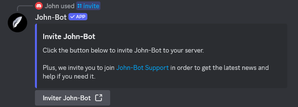

**Video tutorial related to this page:** [Adding John-Bot to Your Discord Server - Tutorial #1](https://jnbt.xyz/tutorials/add)

# :link: Access the Invitation Page
To add John-Bot to your Discord server, head to John-Bot's invitation page.
You can access it in several ways:
* Through the website, then click the "Add to Discord" button;
* Using the `/invite` command on a server that already has the bot (see image);
* Through the direct link: [https://jnbt.xyz/invite](https://jnbt.xyz/invite/docs)

# :envelope: Invitation Process
Once on the invitation page, select the server you want to add John-Bot to, then click "Continue." Make sure the "Administrator" permission is properly checked, then confirm by clicking "Authorize." You may be asked to enter your two-factor authentication code ([2FA Support](https://support.discord.com/hc/en-us/articles/219576828-Setting-up-Two-Factor-Authentication)) or complete a CAPTCHA to verify you're not a robot.

# :hourglass: Finalization
After confirming the addition of John-Bot, check that it's online on your server. If it is, we recommend moving on to the next section of the getting started guide. If it isn't, this is usually caused by a misconfigured anti-raid bot or a permissions issue.
  If you run into any issues, feel free to [contact the John-Bot team](../contact.md).
