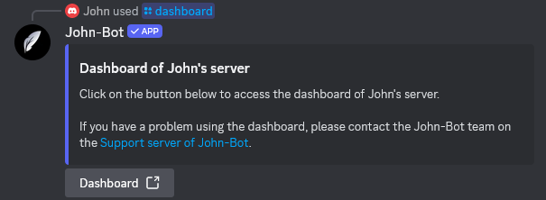

**Video tutorial related to this page:** [Preparing Your Server for John-Bot Configuration (Prerequisites) - Tutorial #2](https://youtu.be/f1vCYjXOlvc)

# :clipboard: Verify Permissions
To function properly, John-Bot must have a certain number of permissions. It is strongly recommended to assign the administrator permission to avoid any conflicts.
  When adding John-Bot, you probably already assigned these permissions, but a check is necessary. To do this, go to your Discord server settings.

# :pushpin: Access the Dashboard
To configure John-Bot, you need to access the dashboard.
  Here are the different ways to access it:

## Using the /dashboard command
Go to the Discord server you want to configure and access a channel where you can execute commands. Then type the command `/dashboard` in this channel and click on the button titled `Dashboard`.
  You will be redirected to your server's dashboard page and may need to authenticate with your Discord account. If so, simply click the `Authorize` button at the bottom right.

## Via the website
Go to John-Bot's website at: https://johnbot.app/ and click on the button at the top titled `Dashboard`. You may need to authenticate with your Discord account. If so, simply click the `Authorize` button at the bottom right. Then, choose the Discord server you want to configure and click on it. You will then be redirected to your server's dashboard page.

## With the exact web address
You can directly access your server's dashboard by entering the following format into your web browser: `https://johnbot.app/dashboard/guildId`
  Replace `guildId` with your server's identifier¹.

# :flag_fr: Set the Language
Before starting any configuration, it is advisable to choose the display language for John-Bot.
Find out how to do it: [Change Your Server's Language](../usage/configuration/langue.md)

---
1: Find your server's identifier: [Where to Find My User/Server/Message ID?](https://support.discord.com/hc/en-us/articles/206346498-Where-can-I-find-my-User-Server-Message-ID)