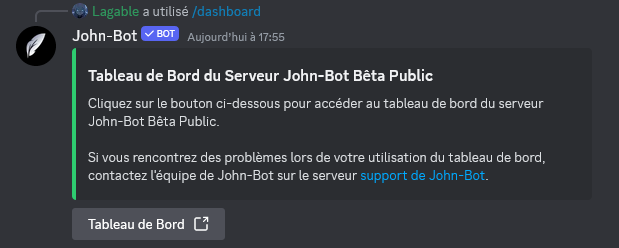

**Video tutorial related to this page:** [Preparing Your Server for John-Bot Configuration (Prerequisites) - Tutorial #2](https://jnbt.xyz/tutorials/start)

# :clipboard: Verify Permissions
To function properly, John-Bot must have a certain number of permissions. It is strongly recommended to assign the administrator permission to avoid any conflicts.
  When adding John-Bot, you probably already assigned these permissions, but a check is necessary. To do this, go to your Discord server settings.

# :pushpin: Access the Dashboard
To configure John-Bot, you need to access the dashboard.
  Here are the different ways to access it:

## Using the /dashboard command
Go to the Discord server you want to configure and access a channel where you can execute commands. Then type the command `/dashboard` in this channel and click on the button titled `Dashboard`.
  You will be redirected to your server's dashboard page and may need to authenticate with your Discord account. If so, simply click the `Authorize` button at the bottom right.

## Via the website
Go to John-Bot's website at: https://johnbot.app/ and click on the button at the top titled `Dashboard`. You may need to authenticate with your Discord account. If so, simply click the `Authorize` button at the bottom right. Then, choose the Discord server you want to configure and click on it. You will then be redirected to your server's dashboard page.

## With the exact web address
You can directly access your server's dashboard by entering the following format into your web browser: `https://johnbot.app/dashboard/guildId`
  Replace `guildId` with your server's identifier¹.

# :flag_fr: Set the Language
Before starting any configuration, it is advisable to choose the display language for John-Bot.
Find out how to do it: [Change Your Server's Language](../usage/configuration/language.md)

# :gem: Activate John-Bot Premium

John-Bot Premium is the paid version of John-Bot that provides more features to make your Discord server even better. Subscribing to a Premium plan also helps cover the costs associated with running the application, allowing for a fully free version of John-Bot for everyone, no strings attached.


You can check the comprehensive list of Premium benefits compared to the free version of John-Bot at: [https://johnbot.app/premium](https://johnbot.app/premium)


## Subscribe to John-Bot Premium

First, go to [https://johnbot.app/premium](https://johnbot.app/premium) and choose the plan that fits your needs. You will be redirected to the Patreon payment page, where you will need to create an account. Follow the steps on Patreon until your subscription is confirmed.

## Link Your Patreon Account

Next, you will need to link your Patreon account on the John-Bot dashboard. To do this, go to the dashboard of one of your servers and click on your profile picture in the top left. Make sure your Patreon account is properly linked.

## Activate John-Bot Premium

Finally, you will need to activate John-Bot Premium on the desired servers by using the command `/premium` on those servers and confirming the activation. To deactivate John-Bot Premium, you can enter the command `/premium` and click on `reset`.

## Manage or Cancel Your Subscription

To change your plan, go to the [Subscription section of the John-Bot page on Patreon](https://www.patreon.com/c/johnbot/membership). You will have access to the three available plans and can choose the one that suits your needs.
  To cancel your subscription, go to the [Memberships section in your Patreon settings](https://www.patreon.com/settings/memberships). You can cancel your subscription by revealing the additional options and clicking on `Cancel Subscription`.

---
1: Find your server's identifier: [Where to Find My User/Server/Message ID?](https://support.discord.com/hc/en-us/articles/206346498-Where-can-I-find-my-User-Server-Message-ID)