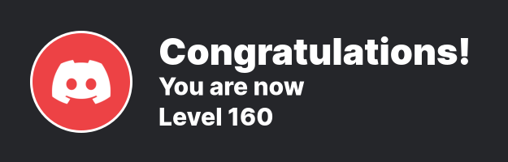
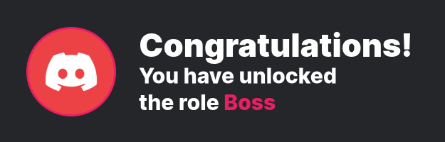
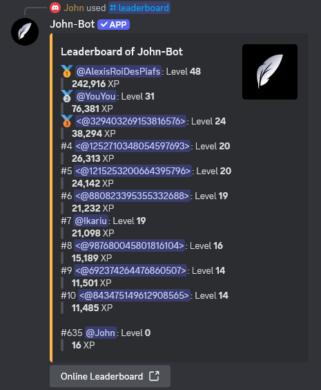
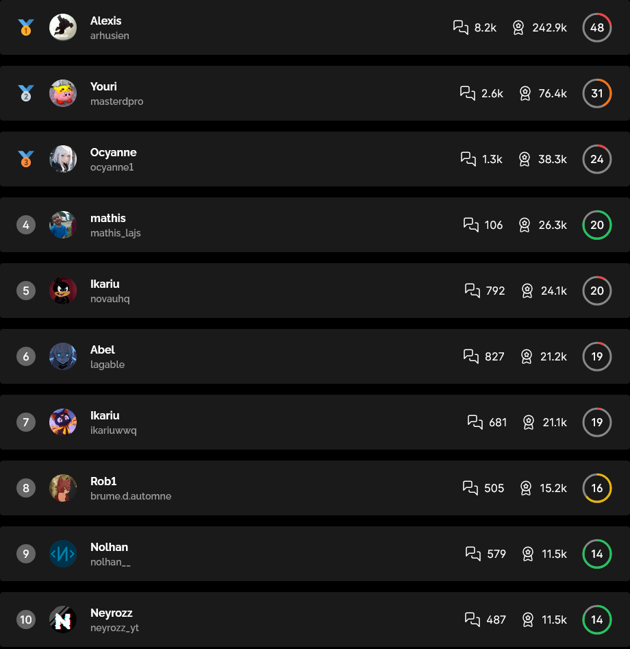
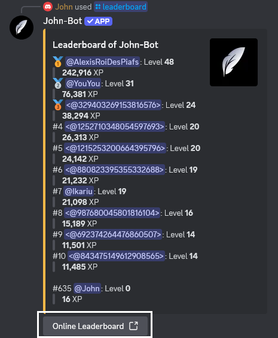
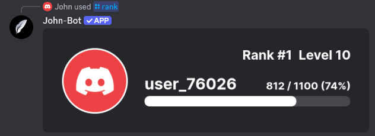
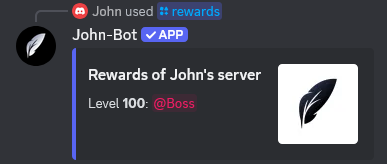

# Levels

**Video tutorial related to this page:** [Configure John-Bot's Level System - Tutorial #6](https://youtu.be/3gZlLS7rBT8)

## :rocket: Introduction

To maintain consistent activity on a Discord server, the most recommended method is to reward members with levels and ranks. Based on this concept, John-Bot offers an enhanced version with levels earned through experience points and the assignment of virtual rewards via roles when specific milestones are reached.

## :tools: Configuring the System

### Access the Dashboard

First, go to the John-Bot dashboard through the method of your choice. Learn how to do it here: [How to Access the Dashboard](../../guide/base.md#pushpin-access-the-dashboard)

### Access the Settings

Next, look for `Levels` on the right-hand column, under your server's logo and banner. You will now be on a page where you can access all the settings related to the level system.

### Import from Another Application

If you're currently using another application to manage your server's leveling system, you can import all your data in just a few moments using a simple command¹.

At the moment, only the MEE6 application is supported, but this feature may evolve to include other applications.

Import from MEE6

Before entering the command to import your leveling data from MEE6, you must make your server's leaderboard public.

* To do this, access your server's leaderboard with the `/levels` command via the MEE6 app. Then log in to your Discord account on the MEE6 site and click the `Settings` button located at the top right of the page.
* Once on your server leaderboard's settings page, enable the `Make my server's leaderboard public` option at the top of the page. Finally, save your changes.

Next, go to your server and enter the `/xp import` command with John-Bot, then confirm the replacement of the current data with those from MEE6.

Make sure that John-Bot's level system is properly activated and configured. The import only concerns level data, without including the customization of announcements or other elements.

## :earth_africa: Global System

The leveling system works with experience points that can be earned by sending a message or spending time in a voice channel. You can set the amount of experience points gained per message or per minute, as well as a rate. A level corresponds to a milestone, achievable by accumulating a specific number of experience units.

Details on how to gain experience, as well as the experience required to unlock a level, are available in [the subpage linked to this page](levels-xp.md).

### Level-Up Announcement

When a new level is unlocked, John-Bot can instantly send a customized announcement in a designated channel.

* **Enable announcement:** To activate level-up announcements, check this option.
* **Enable image:** With each announcement, an image representing the member is generated, also indicating the level reached at that moment.

<figure><figcaption>
Image of a level-up announcement
</figcaption></figure>

* **Channel choice:** You can choose to send the level-up announcement in the last channel where the member sent a message² by selecting `In the current channel` from the dropdown menu, or send the announcement in a specific channel, always the same for each announcement, by selecting `In a custom channel` from the dropdown menu, then specifying the channel using the second dropdown menu that appears below or to the right, depending on your device.
* **Level-up message:** In addition to the level-up image, you can add a personalized message, compatible with [level variables](../../ressources/variables.md#level-variables).

### Additional Options

**Experience ratio**

This option allows you to set the amount of experience points awarded to a member per message or per minute spent in a voice channel. You can choose a range using the dropdown menu; the exact amount will be randomly determined.

**Maximum level :gem:**

You can set a maximum level that will prevent members who have reached this level from gaining more experience. To disable this option, set it to `0`.

**Voice experience :gem:**

By enabling this option, you allow your members to earn experience points in voice channels, as long as there are at least two human members in the voice channel.

**Level loss upon departure**

With this option enabled, if a member leaves the server, their experience will be reset.

**No experience gain in ticket**

When this option is enabled, no experience points will be awarded to members sending messages in ticket channels.³

**Experience rate :gem:**

If you want to increase the experience gained to make it easier to access higher levels, you can choose to award experience points up to 3 times faster.

### Special Roles and Channels

* **Bonus roles and channels:** You can set roles and channels where sent messages or minutes spent in voice chat earn more experience points. You can adjust the bonus multiplier⁴ by clicking on the number located before the role or channel name.
* **No-gain roles and channels:** You can set roles and channels where sent messages or minutes spent in voice chat earn no experience.

## :dart: Rewards

To encourage members to reach higher levels, you can set unlockable rewards in the form of roles when a member reaches a specific level.

### Reward Unlock Announcement

When a new level is reached and a reward is unlocked, John-Bot can instantly send a customized announcement in a designated channel.

* **Enable announcement:** To activate reward unlock announcements, check this option.
* **Enable image:** With each announcement, an image representing the member is generated, also indicating the unlocked reward.

<figure><figcaption>
Image of a reward unlock announcement
</figcaption></figure>

* **Channel choice:** You can choose to send the reward unlock announcement in the last channel where the member sent a message² by selecting `In the current channel` from the dropdown menu, or send the announcement in a specific channel, always the same for each announcement, by selecting `In a custom channel` from the dropdown menu, then specifying the channel using the second dropdown menu that appears below or to the right, depending on your device.
* **Reward unlock message:** In addition to the reward unlock image, you can add a personalized message, compatible with [level variables](../../ressources/variables.md#level-variables).

### Reward Role Types :gem:

Reward roles are assigned when a member reaches the required level. You can choose whether a member can only have one reward role at a time on their profile by selecting `Progressive reward roles`. When a new reward is unlocked, the current role will be removed from the member's profile and replaced with the newly unlocked role. If you want the member to accumulate roles, select `Cumulative reward roles`.

### Reward Configuration

To create a reward, click the button at the bottom of the page and define the following two parameters:

* **Required level:** Set the required level to unlock this reward by entering it in the designated field.
* **Reward roles:** Define the role that will be assigned as a reward when the member reaches the required level by selecting it using the corresponding dropdown menu.

## :bar_chart: Leaderboard

Your server's leaderboard lists members in descending order based on their experience points, showing their level and accumulated experience points.  
  It can be accessed via the `leaderboard` command, which displays the top ten members. A complete version is available online.

Example of a leaderboard using the /leaderboard command

Example of the complete online leaderboard

### Accessing the Server Leaderboard

You can access the complete online leaderboard in two ways:
* **Full URL:** The web address (URL) of a server's leaderboard is composed as follows: `https://www.johnbot.app/leaderboard/serverid`. Simply replace the `serverid` variable with your server's ID⁵.
* **Link via a command:** You can easily obtain this link using the `/leaderboard` command.

## :wrench: Command List

| Command | Description | Example |
| ------- | ----------- | ------- |
| /leaderboard | Displays the server members' level leaderboard. |  |
| /rank or /level | Displays your level or a member's level. |  |
| /xp add | Adds experience to a member. |  |
| /xp remove | Removes experience from a member. |  |
| /xp import | Imports leveling data from other bots. |  |
| /xp reset | Resets the leveling data of a member or all server members. | [Command /xp reset](../../.gitbook/assets/levels_commande_xp%20reset.png) |
| /xp user | Displays a member's total experience and level. |  |
| /rewards | Displays the list of rewards that can be unlocked with the leveling system. |  |

***

1: Subject to the availability of the corresponding application  
2: The message will be sent to the voice channel chat if the member levels up in a voice channel  
3: Tickets must be managed with John-Bot's [ticket system](../configuration/tickets.md)  
4: Only among the following numbers: `1.5; 2; 2.5; 3`  
5: Find your server ID: [Where can I find my user/server/message ID?](https://support.discord.com/hc/en-us/articles/206346498-Where-can-I-find-my-user-server-message-ID)