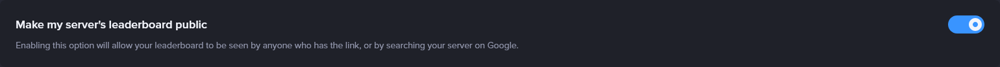

# Leveling

**Video tutorial related to this page:** [Setting Up John-Bot's Leveling System - Tutorial #7](https://jnbt.xyz/tutorials/levels)

## :rocket: Introduction

To keep your Discord server active, the most effective approach is to reward your members — notably with levels and ranks. Building on this concept, John-Bot offers an enhanced leveling system where members earn experience points (XP), level up, and unlock virtual rewards in the form of roles when they hit specific milestones.

## :tools: Configuring the System

### Accessing the Dashboard

First, go to the John-Bot dashboard using your preferred method. Learn how: [How to access the dashboard](../../guide/guide.md#pushpin-access-the-dashboard)

### Accessing Settings

Next, look for `Levels` in the right-hand column, under your server's logo and banner. You'll now be on a page where you can access all settings for the leveling system.

### Importing from Another Bot

If you're currently using another bot to manage leveling on your server, you can import all your data in seconds with a simple command¹.

Currently, only MEE6 is supported, but more bots may be added in the future.

Import from MEE6

Before running the import command, you need to make your server's MEE6 leaderboard public.

* To do this, open your server's leaderboard with the `/levels` command via MEE6. Then log in with your Discord account on the MEE6 website and click the `Settings` button at the top right of the page.
* On the leaderboard settings page, enable the `Make my server's leaderboard public` option at the top. Save your changes.

Next, go to your server and run the `/xp import` command with John-Bot, then confirm the data replacement.

Make sure John-Bot's leveling system is properly enabled and configured. The import only covers level data — it won't carry over announcement customization or other settings.

## :earth_africa: Global System

The leveling system is based on experience points earned by sending messages or spending time in voice channels. You can set the amount of XP gained per message or per minute, as well as a rate. Each level is a milestone unlocked by accumulating a specific amount of XP.

For details on how XP is earned and the XP required to unlock each level, see [the Experience subpage](levels-xp.md).

### Level-Up Announcement

When a member reaches a new level, John-Bot can instantly send a customized announcement in a designated channel.

* **Enable announcement:** Toggle this to activate level-up announcements.
* **Enable image:** With each announcement, a personalized image card is generated for the member, showing their new level.

<figure><figcaption>
Level-up announcement image
</figcaption></figure>

* **Channel choice:** You can send the announcement in the last channel where the member sent a message² by selecting `In the current channel`, or always send it to the same specific channel by selecting `In a custom channel` and then choosing the channel from the second dropdown.
* **Level-up message:** In addition to the image, you can add a custom text message using [level variables](../../ressources/variables.md#level-variables).

### Additional Options

**XP Ratio**

This option sets the amount of XP awarded per message or per minute in voice chat. Choose a range from the dropdown — the exact amount will be randomly determined within that range.

**Maximum Level** :gem:

Set a cap on levels. Members who reach this level will no longer earn XP. Set it to `0` to disable.

**Voice XP** :gem:

Enable this to let members earn XP for time spent in voice channels. They must be in a channel with at least one other human member (bots don't count).

**Level Loss on Leave**

When enabled, a member's XP will be reset if they leave the server. If they rejoin, they'll start from scratch.

**No XP Gain in Tickets**

When enabled, no XP is awarded for messages sent in ticket channels.³

**XP Multiplier** :gem:

To help members level up faster — for example, during a special event — you can award up to 3x the normal XP rate.

### Special Roles and Channels

* **Bonus roles and channels:** Set roles and channels where messages or voice time earn bonus XP. You can adjust the bonus multiplier⁴ by clicking the number next to the role or channel name.
* **No-gain roles and channels:** Set roles and channels where messages or voice time earn zero XP.

## :dart: Rewards

To motivate members to reach higher levels, you can set up unlockable rewards — roles that are automatically assigned when a member reaches a specific level.

### Reward Unlock Announcement

When a member reaches a new level and unlocks a reward, John-Bot can instantly send a customized announcement in a designated channel.

* **Enable announcement:** Toggle this to activate reward unlock announcements.
* **Enable image:** With each announcement, a personalized image card is generated, showing the unlocked reward.

<figure><figcaption>
Reward unlock announcement image
</figcaption></figure>

* **Channel choice:** You can send the announcement in the last channel where the member sent a message² by selecting `In the current channel`, or always send it to the same channel by selecting `In a custom channel` and choosing the channel from the second dropdown.
* **Reward unlock message:** In addition to the image, you can add a custom text message using [level variables](../../ressources/variables.md#level-variables).

### Reward Role Types :gem:

Reward roles are assigned when a member reaches the required level. You can choose between two modes:

* **Progressive reward roles:** A member can only have one reward role at a time. When a new reward is unlocked, the previous role is removed and replaced by the new one.
* **Cumulative reward roles:** The member keeps all earned reward roles, stacking them up as they progress.

### Reward Configuration

To create a reward, click the button at the bottom of the page and set the following:

* **Required level:** Enter the level a member must reach to unlock this reward.
* **Reward role:** Select the role that will be assigned as a reward using the dropdown.

## :bar_chart: Leaderboard

Your server's leaderboard ranks members in descending order by XP, showing each member's level and total experience points.

You can access it via the `/leaderboard` command, which shows the top 10 members. A full version is available online.

Example leaderboard using /leaderboard

Example of the full online leaderboard

### Accessing the Leaderboard

You can access the full online leaderboard in two ways:

* **Direct URL:** The leaderboard URL follows this format: `https://www.johnbot.app/leaderboard/serverid`. Replace `serverid` with your server's ID⁵.
* **Link via command:** You can get this link easily by running `/leaderboard`.

## :wrench: Command List

| Command         | Description                                                                  | Example                                                                        |
| --------------- | ---------------------------------------------------------------------------- | ------------------------------------------------------------------------------ |
| /leaderboard    | Shows the server's level leaderboard.                                        |   |
| /rank or /level | Shows your level or another member's level.                                  |      |
| /xp add         | Adds XP to a member.                                                         |          |
| /xp remove      | Removes XP from a member.                                                    |    |
| /xp import      | Imports level data from another bot.                                         |                                                                                |
| /xp reset       | Resets the level data of a member or all members on the server.              |      |
| /xp user        | Shows a member's total XP and level.                                         |        |
| /rewards        | Shows the list of unlockable rewards from the leveling system.               |          |

***

1: subject to the other bot's availability
2: the message will be sent to the voice channel chat if the member levels up in a voice channel
3: tickets must be managed with John-Bot's [ticketing system](tickets.md)
4: limited to the following values: `1.5; 2; 2.5; 3`
5: Find your server's ID: [Where can I find my User/Server/Message ID?](https://support.discord.com/hc/en-us/articles/206346498-Where-can-I-find-my-User-Server-Message-ID)
