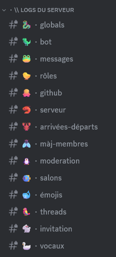
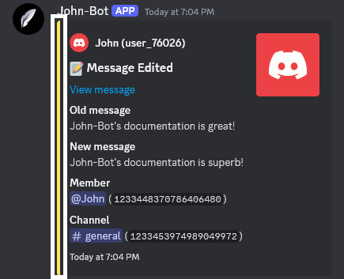

**Video tutorial related to this page:** [Setting up the John-Bot logging system - Tutorial #6](https://jnbt.xyz/tutorials/logs)

## :rocket: Introduction
A logging system on Discord is an essential tool for monitoring and recording activities that occur on a Discord server. It allows you to record in server channels all activities related to messages, roles, server events, member arrivals and departures, member updates, moderation, channels, emojis, threads, and activities in voice channels.
  John-Bot allows you to choose a channel where all logs will be sent, but also to specialize certain channels for certain systems.

You can also customize many elements to make your system as useful and practical as possible, such as color, global reception channel events, and even channels ignored by the system.

## :tools: Configuring the System

### Accessing the Dashboard

First, go to John-Bot's dashboard using your preferred method. Find out how: [How to Access the Dashboard](../../guide/base.md#pushpin-access-the-dashboard)

### Accessing Settings

Next, look for `Logs` in the right column, under your server's logo and banner. You will now arrive on a page where you can access all settings related to the logging system.

### Activating the System

To reveal the system settings, you need to activate it using the associated button.

### Global Reception Channel

The global reception channel for logs allows you to host a large number of events in one place. First, set the global reception channel in the corresponding field. You can then choose the events that will be sent to this channel by checking the associated boxes in the list under `global embed color configuration`. If you want to activate all events, simply check the box `Enable or disable all events`.

### Ignored Channel⸱s

All actions performed in the ignored channels will not be logged, across all events. To define one or more ignored channels, select them from the list in the corresponding field.

### Global Color :gem:

This option allows you to set the color of the log embeds that will be sent to the server. To do this, select the desired color from the 6 proposals or using the color picker.

### Specialized Channels

For each system event, you can define a specific channel. To do this, choose the event you want and set a channel using the corresponding dropdown menu.


If the global reception channel is set to the same channel as one or more specific events, log messages will be sent twice.
