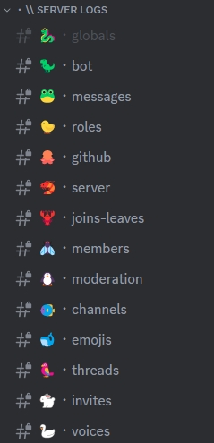

**Video tutorial related to this page:** [Setting Up John-Bot's Logging System - Tutorial #6](https://jnbt.xyz/tutorials/logs)

## :rocket: Introduction
A logging system on Discord is an essential tool for monitoring and recording all activity on your server. It logs everything — from messages, roles, and server changes, to member joins and leaves, member updates, moderation actions, channels, emojis, threads, and voice channel activity — directly into designated server channels.
  John-Bot lets you set a single channel to receive all logs, but also allows you to assign specific channels for specific event categories.

You can also customize many aspects of the system to make it as useful as possible, such as the embed color, which events go to the global channel, and even which channels are ignored by the system.

## :tools: Configuring the System

### Accessing the Dashboard

First, go to the John-Bot dashboard using your preferred method. Learn how: [How to access the dashboard](../../guide/guide.md#pushpin-access-the-dashboard)

### Accessing Settings

Next, look for `Logs` in the right-hand column, under your server's logo and banner. You'll now be on a page where you can access all settings for the logging system.

### Enabling the System

To reveal the system settings, toggle the system on using the associated button.

### Global Log Channel

The global log channel receives all logged events in one place. First, set the global channel in the corresponding field. You can then choose which events are sent to this channel by checking the boxes in the list under the `global embed color configuration`. To enable all events at once, simply check the `Enable or disable all events` box.

### Ignored Channels

Any activity in ignored channels won't be logged, regardless of the event type. To set one or more ignored channels, select them from the list in the corresponding field.

### Global Color :gem:

This option lets you set the color of the log embeds sent to your server. Choose from the 6 preset colors or use the color picker.

### Specialized Channels

For each event type, you can assign a dedicated channel. To do so, select the event you want and assign a channel using the corresponding dropdown menu.


If the global log channel is set to the same channel as one or more specific events, log messages will be sent twice.

