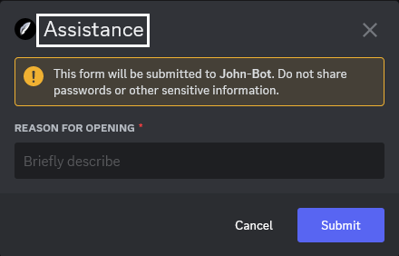

# Tickets

**Video tutorial related to this page:** [Setting up John-Bot's Ticket System - Tutorial #4](https://youtu.be/wnepmF3Bdbc)

## :rocket: Introduction

A ticket system allows members to contact the server team (staff) in a private channel created upon request. John-Bot takes this type of system to the next level by adding the ability to choose the most appropriate reason for an assistance request and specify it using a modal on Discord.

To create a ticket system, you need to create one or more panels, each corresponding to a type of assistance request (for example, one for contacting moderation, one for partnership requests, and another for administrative inquiries). Then, you'll need to create one or more embeds that correspond to the messages allowing members to interact to create a ticket. You can add multiple panels to each one. Finally, you have the option to create one or more modals that correspond to the forms appearing when a member interacts with one of the buttons and thus accesses a panel.

## :earth_africa: Global Configuration

### Accessing the Dashboard

First, go to John-Bot's dashboard using your preferred method. Learn how: [How to Access the Dashboard](../../guide/base.md#pushpin-accessing-the-dashboard)

### Accessing Settings

Next, look for `Tickets` on the right-hand column, under your server's logo and banner. You will now be on a page where you can configure all your server settings related to the ticket system and view transcripts.

### Logs

Logs record all ticket-related actions in a server channel.\
When a ticket is deleted, a certain amount of information related to that ticket will be made available in a message. You will find the ticket ID, the user who initiated the ticket, the user who closed the ticket, the user who deleted the ticket, the ticket's opening date, the ticket's name, the assistance team member who handled the ticket, and the list of users who wrote a message in the ticket (excluding John-Bot). Also, under this message, you can find the link to the ticket transcript, provided the option is activated as indicated later on this page. This is attached to the message but is difficult to read and access.

To enable logs for ticket deletion, simply check the `Enable logs` box and select the channel where you want to store these messages.


It is strongly recommended to make the ticket logs channel private. Some information could be private and should not be accessible to just anyone but to the trusted team.


### Global Ticket Limit

This option limits the number of tickets open simultaneously by a member on the server, across all panels. If a ticket limit is later applied to any panel, it will override this for that panel. Simply choose the maximum number of tickets with the corresponding field.

### Transcripts

A transcript allows you to review the conversation history of a ticket. They can be very useful for future reference, issue tracking, or even team training. John-Bot's transcripts allow you to view the conversation history in a layout simulating Discord's original layout to make reading more enjoyable and coherent.

#### Enable Transcripts

To enable transcripts, you must first have enabled ticket logs and set a channel for sending logs. Once done, simply click the `Enable transcripts` button.

#### View Transcripts

You can view transcripts in two different ways:

* First, you can go to the dashboard, then to the `Tickets` page, and click the button in the top right corner `View transcripts`. You will then see a list of all transcripts stored for your server as well as a search engine to help you find the one you're looking for.
* Second, you can go to the ticket logs channel directly on your Discord server and search for the message corresponding to the desired transcript. You can then click the button linked to the message `View transcript` and be redirected to John-Bot's viewer.


If you can't find the transcript you're looking for, it's because it's no longer stored because the ticket logs message associated with that ticket has been deleted or your ticket predates January 26, 2024. In the first situation, there's nothing to do, your transcript is permanently erased. In the second situation, simply search for the ticket logs message associated with the desired ticket, download the .html file attached to the message, and open it in your .html file viewer. Web browsers (Mozilla Firefox, Microsoft Edge, Opera, Google Chrome...) generally support this file type.


### Exclusion Role·s

Exclusion roles prevent certain members from opening tickets. When a member has an exclusion role, they will be unable to create a ticket. Choose one or more roles from your list of roles in the corresponding field to configure this option.

## :jigsaw: Panel Configuration

### Create a Panel

Before you start configuring your panel(s), you need to create them. To do this, simply click the `Create a Panel` button located under the global settings.

### Duplicate a Panel

You can also create a panel from an existing one to retain exactly the same settings and customize it. This avoids having to reconfigure all the settings for a minor difference between the two panels. To do this, simply click the `Duplicate` button corresponding to the desired panel and confirm your choice via the appearing window.

### Modify a Panel

To modify the settings of an existing panel, simply click the `Edit` button corresponding to the desired panel.

### Delete a Panel

To delete an existing panel, simply click the `Delete` button corresponding to the desired panel and confirm your choice via the appearing window.

### Configure a Panel

Once in the settings of a panel, you can configure numerous options to customize the system according to your needs.\
Once configurations are done, simply click the green `Save` button located at the bottom right of the configuration window. If you do not wish to keep your changes, simply click `Cancel`.

#### Panel Name

The panel name allows you to name it to help you navigate among all your panels, but it will not be displayed to members in any case. It is optional. If you do not give a name yourself, it will automatically be named by a number such as `Panel #1`.

#### Ticket Name

The ticket name corresponds to the name that will be given by default to the channel created specifically for the ticket. You can give it a name to differentiate it using variables. If you do not fill in the field, the name will automatically be `help-{user.name}`.

#### Ticket Creation Category

In this field, define the server category in which the channels assigned to the different tickets of the panel will be created. In case of overflow of the category, i.e., when the category reaches its maximum tickets, they will be created outside the category. To set it, choose the desired category from the selection menu in the field or search by typing directly in the field.

#### Ticket Closure Category :gem:

The ticket closure category allows you to get rid of closed tickets to deal with them later. Channels corresponding to closed tickets will be instantly moved to the defined category. To set it, choose the desired category from the selection menu in the field or search by typing directly in the field.

#### Panel-Linked Model

In this field, you can set the model that will appear before ticket opening when the member clicks the button. To do this, choose the desired model from the selection menu in the field or search by typing directly in the field.


To learn how to configure a model, see the corresponding documentation category on this page: [Model Configuration](tickets.md#model-configuration).


#### Period before sending the inactivity reminder :gem:

You can choose for how long the ticket must have received no message before sending the inactivity reminder. By default, this duration is one week, or 7 days. This duration has an accuracy of about 6 hours.\
To set the period before sending the inactivity reminder, select the option that best suits you from the selection menu available in the field.


This option is only effective when the \`**Enable inactivity reminder**\` option is activated. To learn how to activate it, see this category on this page: [Enabling the Inactivity Reminder](tickets.md#inactivity-reminder).


#### Panel Ticket Limit

The panel ticket limit allows you to limit the number of tickets opened by a member on this same panel. For example, if the panel ticket limit is 2, once the member has opened 2 tickets, they will not be able to open a third ticket until they have closed one of the other two. To set it, choose `Enable` and enter a number in the `Ticket Limit` field.\
If this limit is set, it overrides the global limit set previously.

#### Team Roles

Team roles allow you to define multiple permissions based on roles. Below, find the detailed explanation for each permission that can be assigned. To define one or more roles for a permission, click on the field and select the desired role(s). You can also enter the role name to search for it.

* **Assistance Team Roles:** Members of the assistance team are designated to access the ticket and respond in it. By default, they can also manage, close, reopen the ticket, or use management commands.
* **Responsible Team Roles:** Members of the responsible team have the same permissions as the assistance team, but with certain privileges such as exclusive ticket management.
* **Mention Roles on Opening:** Roles to mention on opening will, as their name suggests, be mentioned upon ticket opening, without apparent message, using the "ghost-ping" method. The member originating the ticket will always be mentioned, but choosing a role they have will not mention them twice.
* **Exclusion Roles:** Exclusion roles prevent certain members from opening tickets in the panel. When a member has an exclusion role, it is impossible for them to create a ticket in the panel.

#### Ticket Assignment

Ticket assignment allows the assistance team to better organize. By simply clicking the `Process` button attached to the opening message, the corresponding assistance team member will be designated as the "Handler" of the ticket, and a message will be sent in the channel to report it. To activate this option, simply check the associated box.


This option allows using the \`**Exclusive Ticket Management**\` option. To learn how to activate it, see this category on this page: [Exclusive Ticket Management](tickets.md#exclusive-ticket-management).


#### Inactivity Reminder

The inactivity reminder reminds all ticket participants that the ticket is inactive by sending a message after a defined period. To activate this option, simply check the associated box.


To know how to set the time before sending the reminder, see this category on this page: [Period before sending the inactivity reminder](tickets.md#period-before-sending-the-inactivity-reminder).


#### Private Message Warning

The private message warning is a message sent privately to the member originating the ticket when it is deleted. It allows the member in question to confirm that their ticket has been deleted and also provides them with some information. To activate it, simply check the associated box.

#### Exclusive Ticket Management

Exclusive management allows only the assistance team member handling the ticket to speak in it, except for administrators and members of the responsible team. To activate this option, simply check the associated box.

#### Ticket Closure on Member Departure :gem:

Ticket closure on member departure automatically closes a ticket when the member who originated it leaves the server. To activate this option, simply check the associated box.

#### Button Visual

To make your button more attractive or understandable, you can customize it using the many options provided.

* **Button Label:** The label allows you to customize the text displayed on the button. By default, it will be identical to the panel name.
* **Button Description** :gem: **:** The description allows you to give more indication to your button. It is only visible when the dropdown option is activated. Learn how to activate it on this page, in the corresponding section: [Panel Display Style](tickets.md#customization)
* **Button Emoji:** The emoji allows you to illustrate your button. You can choose from all Discord emojis using the selector.
* **Button Color:** To specify your button, you can choose between the four colors offered by Discord: blue, green, red, or gray.

#### Role Permissions

* **Create a Ticket:** To define who can create a ticket on this panel, choose one or more roles in the corresponding field. If the field is left empty, all members will be able to create a ticket, provided they do not have a ticket exclusion role.
* **Claim Ticket:** To define who can claim or process a ticket on this panel, choose one or more roles in the corresponding field. If the field is left empty, all members of the assistance team will be able to create a ticket.
* **Close Ticket:** To define who can close an open ticket on this panel, choose one or more roles in the corresponding field. If the field is left empty, all members with access to the ticket will be able to close it.
* **Reopen Ticket:** To define who can reopen a closed ticket on this panel, choose one or more roles in the corresponding field. If the field is left empty, all members of the assistance team will be able to reopen a ticket.
* **Delete Ticket:** To define who can delete a closed ticket on this panel, choose one or more roles in the corresponding field. If the field is left empty, all members with access to the closed ticket will be able to delete it.

#### Private Discussion Thread

The private discussion thread allows the assistance team to discuss around the specific subject of the ticket away from prying eyes and without having to create a new channel on the server. To activate it, simply check the associated box. Once the option is activated, you can customize some aesthetic criteria.

**Thread Name**

In this field, enter the name that will automatically be given when creating the thread. You can use [variables](../../resources/variables.md).

**Thread Opening Embed Title**

When opening the private thread, an opening message will automatically be sent. In this field, customize the title that will be given to the embed of this message.

**Thread Opening Embed Description**

When opening the private thread, an opening message will automatically be sent. In this field, customize the description that will be given to the embed of this message.

#### Opening Message

The opening message will be the first message sent upon ticket opening and will also be pinned. It allows you to obtain some essential information for the ticket as well as a message to guide the member originating the ticket. It also contains answers to the model if the panel has one. You can customize some elements of this message, especially to guide the member originating the ticket.

**Text Message**

The text message is the text that will be displayed outside of the embed, like a regular Discord user. You can use emojis and markdown¹ to customize your text. To disable the text message, leave the field blank.

**Embed**

The embed is the part of the message that can contain several customizable elements and will be displayed below the text message. It is impossible to send it for a regular Discord user. You can use the available fields to customize your embed.

* **Enable Opening Embed:** You can check this box if you want to enable the embed in your opening message. If you want to disable the embed, uncheck this box.
* **Embed Author Icon:** :gem: **:** You can illustrate your embed by adding an image (which can be animated) to your author, only visible when the author has a name.
* **Embed Author Name:** :gem: **:** You can customize your embed by adding an author, which you can name as you like.
* **Embed Author Link:** :gem: **:** You can customize your embed by adding a link to an external site to the author.
* **Embed Title:** You can customize your embed by adding a title.
* **Embed Description:** You can customize your embed by adding a description.
* **Embed Color:** You can choose a color to customize your embed using the selector.
* **Embed Thumbnail Link:** :gem: **:** You can illustrate your embed by adding a thumbnail.
* **Embed Image Link:** You can illustrate your embed by adding an image.
* **Embed Footer Icon:** :gem: **:** You can complete your embed with a footer image.
* **Embed Footer Text:** :gem: **:** You can complete your embed with the footer.

## :camera: Embed Configuration

### Create an Embed

Before you start configuring your embeds, you first need to create them. To do this, simply click on the `Create an embed` button located under the panel settings.

### Duplicate an Embed

You can also create an embed from an existing one to keep the same settings and customize it. This saves you from having to reconfigure all the settings for a minor difference between the two embeds. To do this, simply click on the `Duplicate` button corresponding to the desired embed and confirm your choice via the appearing window.

### Edit an Embed

To edit the settings of an existing embed, simply click on the `Edit` button corresponding to the desired embed.

### Delete an Embed

To delete an existing embed, simply click on the `Delete` button corresponding to the desired embed and confirm your choice via the appearing window.

### Configure an Embed

Once in the settings of an embed, you can configure many options to customize the system according to your needs. Once the configurations are complete, simply click on the green `Save` button located at the bottom right of the configuration window. If you do not want to keep your changes, simply click `Cancel`.

#### Embed Sending Channel

In this field, set in which channel your embed will be sent using the associated selection menu.

#### Panels Linked to the Embed

Choose which panels members will be able to use to open a ticket. Organize your panels in the order you want; they will appear the same way on the embed. To do this, select your panel(s) using the associated selector.

#### Customization

* **Embed Author Icon** :gem: **:** You can illustrate your embed by adding an image (which can be animated) to your author, only visible when the author has a name.
* **Embed Author Name** :gem: **:** You can customize your embed by adding an author, which you can name as you like.
* **Embed Author Link** :gem: **:** You can customize your embed by adding a link to an external site to the author.
* **Embed Title :** You can customize your embed by adding a title.
* **Panels Display Style :** You can choose the display style of the panels by selecting the desired option.
* **Embed Description :** You can customize your embed by adding a description.
* **Embed Color :** You can choose a color to customize your embed using the selector.
* **Embed Thumbnail Link** :gem: **:** You can illustrate your embed by adding a thumbnail.
* **Embed Image Link :** You can illustrate your embed by adding an image.
* **Embed Footer Icon** :gem: **:** You can complete your embed with a footer image. By default, the image will be the bot's profile picture.
* **Embed Footer Text** :gem: **:** You can complete your embed with the footer. By default, it will be `Powered by johnbot.app`.

#### Send an Embed

Once your configuration is complete, you can publish your embed by sending it to the predefined channel. To do this, click on the `Send embed` button associated with the chosen embed.

## :bookmark_tabs: Modal Configuration

A modal is a form that will be offered to the member via a native Discord pop-up to allow them to answer up to 5 questions to specify the subject of the ticket. The results of the answers will be attached to an embed in the ticket opening message.

### Create a Modal

Before you start configuring your modal(s), you need to create them. To do this, simply click on the `Create a modal` button located under the embed settings.

### Duplicate a Modal

You can also create a modal from an existing one to find exactly the same settings and customize it. This avoids having to reconfigure all the settings for a minor difference between the two modals. To do this, simply click on the `Duplicate` button corresponding to the desired modal and confirm your choice via the appearing window.

### Edit a Modal

To edit the settings of an existing modal, simply click on the `Edit` button corresponding to the desired modal.

### Delete a Modal

To delete an existing modal, simply click on the `Delete` button corresponding to the desired modal and confirm your choice via the appearing window.

### Configure a Modal

Once in the settings of a modal, you can add up to 5 questions according to your needs and define a few settings. Once the configurations are complete, simply click on the green `Save` button located at the bottom right of the configuration window. If you do not want to keep your changes, simply click `Cancel`.

#### Modal Title

In this field, you can set a title for the modal. This helps you to organize but is also displayed at the top of the pop-up.

#### Question Configuration

For each question, you can customize some aesthetic elements and rearrange your questions. To create a new question, click on the `+` button below the list of questions. To delete an existing question, click on the red `Delete` button at the bottom right of the corresponding question.

* **Text Box Label:** The text box label corresponds to the question asked (no.1 in the image).
* **Text Box Style:** By setting the text box style (no.2 in the image), choose whether the member can respond in a wide or shorter field. This does not change anything about the character limit, which will be 1024 for both.
* **Text Box Placeholder:** The placeholder is the text displayed transparently in the response field, not on which the member will write (no.3) on the image.
* **Required Question:** You can specify whether the question must be answered by the member or if they can submit the form without answering it (no.4 on the image). If the question has no answer, the formula `None` will be in place of the answer.


Once your modal is configured, don't forget to link it to the panel of your choice: [Modal linked to the panel, configure a panel](tickets.md#modèle-lié-au-panneau)


## :wrench: List of Commands

| Command         | Description                                  | Example                                             |
|-----------------|----------------------------------------------|-----------------------------------------------------|
| /ticket delete  | Deletes a closed ticket.                     |                                                     |
| /ticket open    | Opens a closed ticket.                       |  |
| /ticket remove  | Removes a member from the ticket.            |  |
| /ticket rename  | Renames the ticket.                          |  |
| /ticket transfer| Transfers ticket assignment to another team member. |  |
| /ticket unclaim | Removes the ticket assignment from the handler. |  |

---
1: Learn about Markdown: [Markdown Text 101 (Chat Formatting: Bold, Italic, Underline)](https://support.discord.com/hc/en-us/articles/210298617-Markdown-Text-101-Chat-Formatting-Bold-Italic-Underline)
