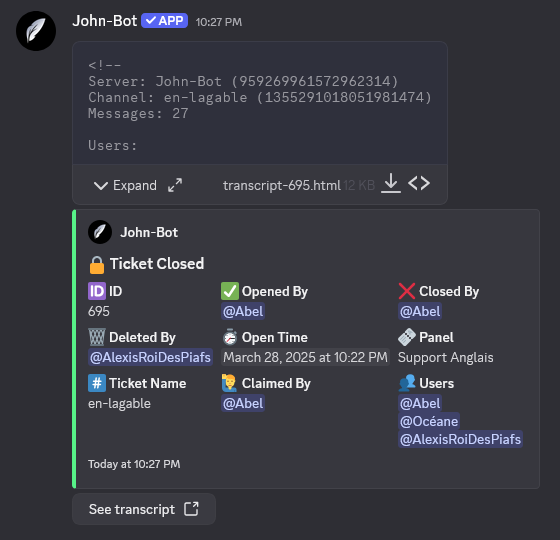
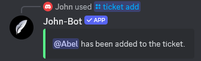
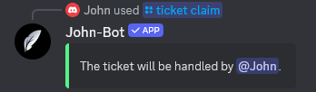

# Tickets

**Video tutorial related to this page:** [Setting Up John-Bot's Ticketing System - Tutorial #4](https://jnbt.xyz/tutorials/tickets)

## :rocket: Introduction

A ticketing system lets members reach out to the server's staff in a private channel created on demand. John-Bot takes this system to the next level by adding features like choosing the most appropriate reason for a support request and specifying it through a modal on Discord.

To set up a ticketing system, you'll need to create one or more panels — each one representing a type of support request (e.g., one for contacting moderation, one for partnership requests, and another for administrative inquiries). Then, you'll create one or more embeds — these are the messages that members interact with to open a ticket. You can link multiple panels to each embed. Finally, you can create one or more modals — forms that appear when a member clicks a button to access a panel.

## :earth_africa: Global Configuration

### Accessing the Dashboard

First, go to the John-Bot dashboard using your preferred method. Learn how: [How to access the dashboard](../../guide/guide.md#pushpin-access-the-dashboard)

### Accessing Settings

Next, look for `Tickets` in the right-hand column, under your server's logo and banner. You'll now be on a page where you can configure all your server's ticketing settings and view transcripts.

### Logs

Logs record all ticket-related actions in a server channel.
When a ticket is deleted, a message will be posted with key information about that ticket: the ticket ID, the user who opened it, the user who closed it, the user who deleted it, the opening date, the ticket name, the support team member who handled it, and a list of users who sent messages in the ticket (excluding John-Bot). Below this message, you'll also find a link to the ticket transcript — provided you've enabled the option as described later on this page. The transcript is attached to the message but can be hard to read and access directly.

To enable ticket deletion logs, simply check the `Enable logs` box and select the channel where you want these messages to be stored.


It is strongly recommended to make the ticket logs channel private. Some information may be sensitive and should only be accessible to trusted team members.


### Global Ticket Limit

This option limits the total number of tickets a member can have open at the same time across all panels. If a per-panel ticket limit is set later, it will override this global limit for that specific panel. Simply choose the maximum number of tickets in the corresponding field.

### Transcripts

A transcript lets you review the full conversation history of a ticket. They're incredibly useful for future reference, issue tracking, or even team training. John-Bot's transcripts display the conversation in a layout that mirrors Discord's native interface, making it easy and natural to read.

#### Enabling Transcripts

To enable transcripts, you must first have ticket logs enabled with a designated log channel. Once that's done, simply click the `Enable transcripts` button.

#### Viewing Transcripts

You can view transcripts in two ways:

* Go to the dashboard, then to the `Tickets` page, and click the `View transcripts` button in the top right corner. You'll see a list of all stored transcripts for your server along with a search engine to help you find the one you're looking for.
* Head to the ticket logs channel directly on your Discord server and find the message for the desired transcript. Click the `View transcript` button attached to the message, and you'll be redirected to John-Bot's transcript viewer.


If you can't find a transcript, it's because the log message for that ticket was deleted, or the ticket was created before January 26, 2024. In the first case, the transcript is permanently lost. In the second case, look for the log message for the desired ticket, download the .html file attached to it, and open it in your browser. Web browsers (Firefox, Edge, Opera, Chrome, etc.) natively support this file type.


### Exclusion Roles

Exclusion roles prevent certain members from opening tickets. When a member has an exclusion role, they won't be able to create a ticket. Select one or more roles from your role list in the corresponding field.

## :jigsaw: Panel Configuration

### Create a Panel

Before you start configuring panels, you need to create them. Simply click the `Create a panel` button located below the global settings.

### Duplicate a Panel

You can also create a panel from an existing one to keep the same settings and customize it from there. This saves you from having to reconfigure everything when there's only a minor difference between two panels. Click the `Duplicate` button next to the desired panel and confirm.

### Edit a Panel

To modify an existing panel's settings, click the `Edit` button next to it.

### Delete a Panel

To delete an existing panel, click the `Delete` button next to it and confirm.

### Configure a Panel

Once in a panel's settings, you can configure many options to customize the system to your needs.
When you're done, click the green `Save` button at the bottom right. To discard your changes, click `Cancel`.

#### Panel Name

The panel name helps you organize and identify your panels — it won't be displayed to members. It's optional. If you don't set one, it will automatically be named something like `Panel #1`.

#### Ticket Name

The ticket name is the default name given to the channel created for the ticket. You can use variables to give it a unique name. If left blank, the default name will be `help-{user.name}`.

#### Ticket Creation Category

In this field, set the server category where ticket channels for this panel will be created. If the category reaches its channel limit, new tickets will be created outside the category. Choose the desired category from the dropdown or type to search.

#### Ticket Closure Category :gem:

The closure category lets you move closed tickets to a separate category to deal with them later. Closed ticket channels will be instantly moved to this category. Choose the desired category from the dropdown or type to search.

#### Panel-Linked Modal

In this field, you can set the modal (form) that will appear before a ticket is opened, when the member clicks the button. Choose the desired modal from the dropdown or type to search.


To learn how to configure a modal, see the corresponding section on this page: [Modal Configuration](tickets.md#modal-configuration).


#### Inactivity Reminder Delay :gem:

You can choose how long a ticket must go without any messages before an inactivity reminder is sent. By default, this is set to one week (7 days). The accuracy is approximately 6 hours.
Select the option that suits you from the dropdown.


This option only takes effect when `**Enable inactivity reminder**` is turned on. To learn how, see: [Inactivity Reminder](tickets.md#inactivity-reminder).


#### Panel Ticket Limit

The panel ticket limit restricts the number of tickets a member can have open on this specific panel. For example, if the limit is 2, a member won't be able to open a third ticket until they close one of the other two. To set it, select `Enable` and enter a number in the `Ticket limit` field.
If set, this overrides the global ticket limit.

#### Team Roles

Team roles let you define different permissions based on roles. Below is a detailed explanation of each assignable permission. To assign roles to a permission, click the field and select the desired role(s). You can also type to search.

* **Support Team Roles:** Support team members have access to the ticket and can respond in it. By default, they can also claim, close, reopen the ticket, or use management commands.
* **Responsible Team Roles:** Responsible team members have the same permissions as the support team, plus certain privileges such as bypassing exclusive ticket management.
* **Roles to Mention on Opening:** These roles will be pinged when a ticket is opened, using the "ghost-ping" method (no visible message). The member who opened the ticket is always mentioned, but having a mentioned role won't cause a double ping.
* **Exclusion Roles:** Exclusion roles prevent certain members from opening tickets on this panel. A member with an exclusion role cannot create a ticket on this panel.

#### Ticket Assignment

Ticket assignment helps the support team stay organized. When a support team member clicks the `Claim` button on the opening message, they'll be designated as the ticket's "Handler" and a message will be posted in the channel to announce it. To enable this, check the associated box.


This option is required to use `**Exclusive Ticket Management**`. To learn how, see: [Exclusive Ticket Management](tickets.md#exclusive-ticket-management).


#### Inactivity Reminder

The inactivity reminder notifies all ticket participants that the ticket has been inactive by sending a message after a set period. To enable it, check the associated box.


To set how long before the reminder is sent, see: [Inactivity Reminder Delay](tickets.md#inactivity-reminder-delay).


#### DM Notification

The DM notification is a private message sent to the member who opened the ticket when it's deleted. It confirms the ticket has been deleted and provides some information, including the ticket transcript. To enable it, check the associated box.

#### Exclusive Ticket Management

Exclusive management restricts the ticket so only the support team member handling it can write in it — except for administrators and responsible team members. To enable it, check the associated box.

#### Auto-Close on Member Leave :gem:

This option automatically closes a ticket when the member who opened it leaves the server. To enable it, check the associated box.

#### Button Appearance

To make your button more appealing or easier to understand, you can customize it with the options provided.

* **Button Label:** Customize the text displayed on the button. By default, it matches the panel name.
* **Button Description** :gem: **:** Add extra context to your button. This is only visible when the dropdown display style is enabled. Learn how to enable it: [Panel Display Style](tickets.md#customization)
* **Button Emoji:** Add an emoji to your button. Choose from all Discord emojis using the picker.
* **Button Color:** Pick from the four colors offered by Discord: blue, green, red, or gray.

#### Role Permissions

* **Create a Ticket:** Define who can create a ticket on this panel by selecting one or more roles. If left empty, all members can create a ticket — unless they have an exclusion role.
* **Claim Ticket:** Define who can claim (process) a ticket on this panel. If left empty, all support team members can claim tickets.
* **Close Ticket:** Define who can close an open ticket on this panel. If left empty, all members with access to the ticket can close it.
* **Reopen Ticket:** Define who can reopen a closed ticket on this panel. If left empty, all support team members can reopen tickets.
* **Delete Ticket:** Define who can delete a closed ticket on this panel. If left empty, all members with access to the closed ticket can delete it.

#### Private Discussion Thread

The private discussion thread lets the support team discuss the ticket's topic privately, without creating a new channel on the server. To enable it, check the associated box. Once enabled, you can customize a few settings.

**Thread Name**

Enter the name that will automatically be assigned when the thread is created. You can use [variables](../../ressources/variables.md).

**Thread Opening Embed Title**

When the private thread is created, an opening message is automatically sent. Customize the embed title of this message.

**Thread Opening Embed Description**

When the private thread is created, an opening message is automatically sent. Customize the embed description of this message.

#### Opening Message

The opening message is the first message sent when a ticket is opened and is also pinned. It contains essential ticket information and a message to guide the member. If the panel has a modal, the answers will also be attached here. You can customize several elements of this message.

**Text Message**

The text message is displayed outside the embed, just like a regular Discord message. You can use emojis and Markdown¹ to style your text. To disable the text message, leave the field blank.

**Embed**

The embed is the part of the message that supports multiple customizable elements and appears below the text message. Regular Discord users can't send embeds. Use the available fields to customize your embed.

* **Enable Opening Embed:** Check this box to enable the embed in your opening message. Uncheck to disable.
* **Embed Author Icon** :gem: **:** Add an image (can be animated) to your embed's author section — only visible when the author has a name.
* **Embed Author Name** :gem: **:** Add an author to your embed, with any name you like.
* **Embed Author Link** :gem: **:** Add a link to an external site on the author.
* **Embed Title:** Add a title to your embed.
* **Embed Description:** Add a description to your embed.
* **Embed Color:** Pick a color for your embed using the color picker.
* **Embed Thumbnail URL:** Add a thumbnail image to your embed.
* **Embed Image URL:** Add an image to your embed.
* **Embed Footer Icon** :gem: **:** Add a footer image to your embed.
* **Embed Footer Text** :gem: **:** Add footer text to your embed.

## :camera: Embed Configuration

### Create an Embed

Before configuring your embeds, you first need to create them. Click the `Create an embed` button located below the panel settings.

### Duplicate an Embed

You can create an embed from an existing one to keep the same settings and customize it from there. Click the `Duplicate` button next to the desired embed and confirm.

### Edit an Embed

To modify an existing embed's settings, click the `Edit` button next to it.

### Delete an Embed

To delete an existing embed, click the `Delete` button next to it and confirm.

### Configure an Embed

Once in an embed's settings, you can configure many options to customize the system. When you're done, click the green `Save` button at the bottom right. To discard your changes, click `Cancel`.

#### Embed Sending Channel

Set which channel your embed will be sent to using the dropdown menu.

#### Panels Linked to the Embed

Choose which panels members will be able to use to open tickets from this embed. Arrange your panels in the order you want — they'll appear in the same order on the embed. Select your panel(s) using the dropdown.

#### Customization

* **Embed Author Icon** :gem: **:** Add an image (can be animated) to your embed's author section — only visible when the author has a name.
* **Embed Author Name** :gem: **:** Add an author to your embed, with any name you like.
* **Embed Author Link** :gem: **:** Add a link to an external site on the author.
* **Embed Title:** Add a title to your embed.
* **Panel Display Style:** Choose the display style for the panels by selecting the desired option.
* **Embed Description:** Add a description to your embed.
* **Embed Color:** Pick a color for your embed using the color picker.
* **Embed Thumbnail URL:** Add a thumbnail image to your embed.
* **Embed Image URL:** Add an image to your embed.
* **Embed Footer Icon** :gem: **:** Add a footer image. Defaults to the bot's profile picture.
* **Embed Footer Text** :gem: **:** Add footer text. Defaults to `Powered by johnbot.app`.

### Send an Embed

Once your configuration is complete, publish your embed by sending it to the designated channel. Click the `Send embed` button next to the chosen embed.

## :bookmark_tabs: Modal Configuration

A modal is a form presented to the member via a native Discord pop-up, allowing them to answer up to 5 questions to specify the subject of the ticket. The answers will be attached to an embed in the ticket's opening message.

### Create a Modal

Before configuring your modals, you need to create them. Click the `Create a modal` button located below the embed settings.

### Duplicate a Modal

You can create a modal from an existing one to keep the same settings and customize it from there. Click the `Duplicate` button next to the desired modal and confirm.

### Edit a Modal

To modify an existing modal's settings, click the `Edit` button next to it.

### Delete a Modal

To delete an existing modal, click the `Delete` button next to it and confirm.

### Configure a Modal

Once in a modal's settings, you can add up to 5 questions and adjust a few settings. When you're done, click the green `Save` button at the bottom right. To discard your changes, click `Cancel`.

#### Modal Title

Set a title for the modal. This helps you stay organized and is also displayed at the top of the pop-up.

#### Question Configuration

For each question, you can customize several visual elements and reorder them. To add a new question, click the `+` button below the question list. To delete a question, click the red `Delete` button at the bottom right of that question.

* **Text Field Label:** The label is the actual question being asked (no. 1 in the image).
* **Text Field Style:** Choose whether the member can respond in a wide or shorter field (no. 2 in the image). This doesn't affect the character limit, which is 1024 for both.
* **Text Field Placeholder:** The placeholder is the hint text displayed in the response field before the member types (no. 3 in the image).
* **Required Question:** Specify whether the question must be answered or if the member can submit the form without filling it in (no. 4 in the image). If left unanswered, `None` will appear in place of the answer.


Once your modal is configured, don't forget to link it to the panel of your choice: [Panel-linked modal, configure a panel](tickets.md#panel-linked-modal)


## :wrench: Command List

| Command | Description | Example |
| -------- | ----------- | ------- |
| /ticket add | Adds a member to the ticket. |  |
| /ticket claim | Assigns a support team member to handle the ticket. |  |
| /ticket close | Closes the ticket. |  |
| /ticket close-request | Requests ticket closure. |  |
| /ticket create | Creates a ticket. |  |
| /ticket delete | Deletes a closed ticket. |  |
| /ticket open | Reopens a closed ticket. |  |
| /ticket remove | Removes a member from the ticket. |  |
| /ticket rename | Renames the ticket. |  |
| /ticket transfer | Transfers ticket assignment to another support team member. |  |
| /ticket unclaim | Removes the ticket assignment from the handler. |  |

---
1: Learn about Markdown: [Markdown Text 101 (Chat Formatting: Bold, Italic, Underline)](https://support.discord.com/hc/en-us/articles/210298617-Markdown-Text-101-Chat-Formatting-Bold-Italic-Underline)
