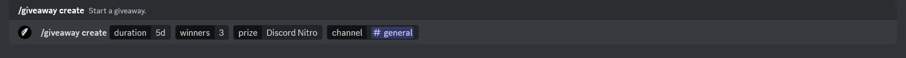
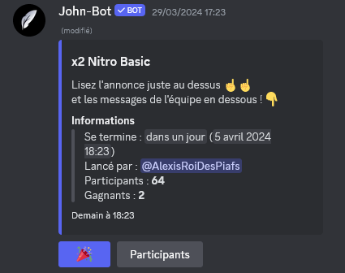

# Giveaway

**Video tutorial related to this page:** [Host a Giveaway on Your Server with John-Bot - Tutorial #8](https://jnbt.xyz/tutorials/giveaways)

## :rocket: Introduction

A giveaway is the perfect way to reward your members by putting a prize up for grabs and letting a random draw decide the winner. Participants can enter with just one click, and the drawing happens automatically at the scheduled time.

There are two ways to create a giveaway: one is quick but less customizable, while the other offers full customization but takes a bit more time. Compare both and pick the one that suits your needs.
Also learn how members can interact with a giveaway to enter, and discover the commands for managing your giveaways.

## :zap: Quick and Simple Method

If you want to launch a giveaway quickly and efficiently, go with this method.

First, head to the server where you want to launch the giveaway. Make sure you have administrator permissions.
Then, type the command `/giveaway create`. You'll have access to several options:

* **Duration:** Set how long the giveaway will last before the automatic drawing and results announcement.
  Enter a number followed by a unit (`s` for seconds, `min` for minutes, `h` for hours, `d` for days).
* **Number of winners:** Set how many winners will be drawn. Simply enter a whole number greater than 0.
* **Prize:** Enter the name of the prize you want to put up for grabs. The field is freeform — it can be physical, virtual, or anything else.
* **Channel (optional):** Choose the channel where the giveaway will be posted, if different from the one you're typing in. If left blank, the giveaway will launch in the current channel.

## :tools: Full Customization Method

If you want to create a detailed and polished giveaway with custom visuals, use this method.

### Accessing the Dashboard

First, go to the John-Bot dashboard using your preferred method. Learn how: [How to access the dashboard](../../guide/guide.md#pushpin-access-the-dashboard)

### Accessing Settings

Next, look for `Giveaways` in the right-hand column, under your server's logo and banner. You'll see a page listing all your server's giveaways, whether ongoing or finished.

### Creating and Configuring

Here's how to configure each setting for your giveaway:

#### Name

Choose a name to identify your giveaway. It will appear in the title of the sent message as well as on the dashboard so you can spot it among others.

#### Sending Channel

Choose the channel where the giveaway will be posted and visible to members. Once sent, the channel cannot be changed.

#### Prize

Enter the name of the prize you want to put up for grabs. The field is freeform — it can be physical, virtual, or anything else. Prize distribution is not automated; you'll need to handle it manually.

#### End Date

Set the exact date and time of the drawing. On this date, a message will automatically be posted in reply to the original giveaway message to announce the winner(s).

#### Number of Winners

Set how many members can be declared winners of the prize.

#### Maximum Number of Participants :gem:

Optionally limit the number of members who can enter the drawing.

#### Participant List Display

You can disable the participant list button by unchecking the associated box.


Learn how this button works in the [direct interaction with the giveaway](giveaway.md#direct-interaction-with-the-giveaway) section.


#### Allowed & Ignored Roles

Use these two fields to restrict the giveaway to certain roles or block certain roles from entering.
Select the desired roles from the corresponding dropdown.

#### Embed

The `embed` section lets you format the message that will be sent and displayed to members.
Customize it to your liking with the many options available.

#### Button :gem:

The `button` section lets you customize the participation button attached to the giveaway message.
You can change its color, text, and emoji.

### Finalize and Send

Once everything is set, double-check your configuration and click the green `Create & Send` button at the top left. Your giveaway will go live in the specified channel with all your customizations. Consider writing an announcement message if the giveaway is tied to a special event.

## :gear: How Giveaways Work

### Giveaway Information

The embed message contains key information about the giveaway. Here's what each field means:

* **Name / Title:** Found in the embed title (bold text at the top).
* **End Date and Time:** Shows the remaining time and the exact end date/time. The field is labeled `Ends:` below the title. It changes to `Ended` once the giveaway is over.
* **Giveaway Author:** Shows who launched the giveaway, identified by their Discord account in the `Launched by:` field.
* **Number of Participants:** Shows how many members have entered, in the `Participants:` field.
* **Number of Winners / Winner(s):** Shows how many winners will be drawn, in the `Winners:` field. After the drawing, this field displays the winner(s) by mention.

### Direct Interaction with the Giveaway

#### Participation Button

Enter the drawing by clicking the customizable button located below the giveaway embed, to the left of the `Participants` button.

#### Participants Button

View the list of everyone who has entered by clicking the `Participants` button located below the giveaway embed, to the right of the participation button.


Learn how to configure this button in the [create and configure](giveaway.md#creating-and-configuring) section.


### Commands

| Command            | Description                              |
| ------------------ | ---------------------------------------- |
| /giveaway create   | Launches a giveaway.                     |
| /giveaway delete   | Deletes a giveaway.                      |
| /giveaway end      | Ends a giveaway early.                   |
| /giveaway list     | Shows all giveaways on the server.       |
| /giveaway reroll   | Picks new winners for a giveaway.        |
