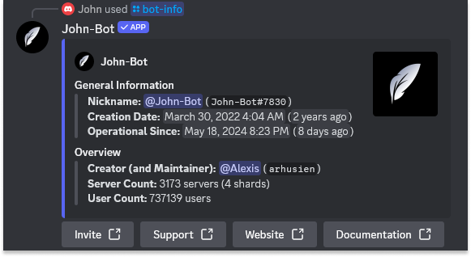
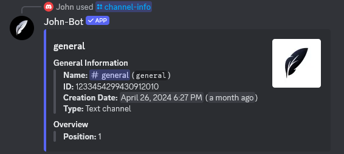
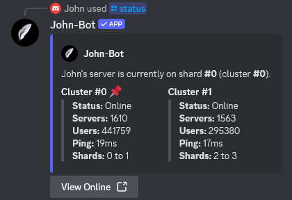

# :rocket: Introduction
If you want to get information about a server, a user... or even the photo or banner of any user or server and much more, John-Bot's information commands are here for you! Discover all of these commands described precisely on this page.

# :clipboard: List of Commands
| Command | Description | Example |
| ----- | ----- | ----- |
| /bot-info | Shows some information about John-Bot. |  |
| /user avatar | Shows a user's avatar. |  |
| /user banner | Shows a user's banner. |  |
| /user info | Shows some information about a user. |  |
| /server icon | Shows the server's icon. |  |
| /server banner | Shows the server banner. |  |
| /server info | Shows some information about the server. |  |
| /server members | Shows some information about members of the server. |  |
| /role info | Shows some information about a role. |  |
| /role color | Shows the color of a role. |  |
| /channel-info | Shows some information about a channel. |  |
| /ping | Shows John-Bot's latency time. |  |
| /status | Shows status of John-Bot's clusters. |  |
| /uptime | Shows how long John-Bot has been operational. |  |
| /color | Shows some information about a color. |  |