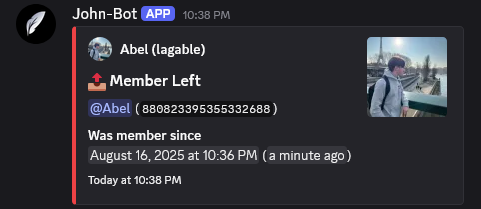
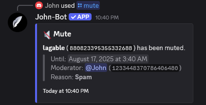
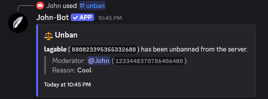
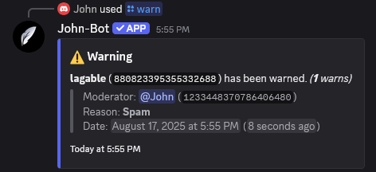

# Moderation

**Video tutorial related to this page:** [Effectively Moderate Your Server with John-Bot - Tutorial #5](https://jnbt.xyz/tutorials/moderation)

### :rocket: Introduction

John-Bot's command-based moderation system gives you the tools to efficiently moderate your Discord server. With powerful commands, you can simplify and speed up moderation to maintain a safe environment — all with advanced features through John-Bot that are unavailable to regular users.

### :clipboard: Command List
| Command | Description | Example |
| ------- | ----------- | ------- |
| /ban | Bans a user from the server. |  |
| /clear | Deletes a number of messages in a channel. |  |
| /kick | Kicks a member from the server. |  |
| /lock | Locks a server channel. |  |
| /mute | Mutes a member for a certain duration. |  |
| /nickname | Changes a server member's nickname. |  |
| /slowmode disable | Disables slowmode in a channel. |  |
| /slowmode set | Sets slowmode in a channel. |  |
| /unban | Unbans a user. |  |
| /unlock | Unlocks a server channel. |  |
| /unmute | Unmutes a muted member. |  |
| /warn | Warns a server member. |  |
| /warnings clear | Clears warnings for a member or all server members. |  |
| /warnings list | Shows a member's warning list. |  |
| /warnings remove | Removes a warning from a member. |  |
