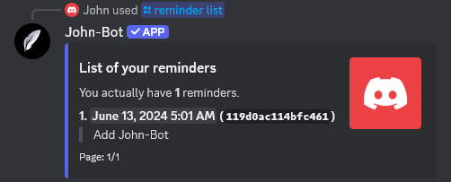

# Reminders

**Video tutorial related to this page:** [Use John-Bot Reminders on Discord - Tutorial #11](https://jnbt.xyz/tutorials/reminders)

# :rocket: Introduction

If you have a task you absolutely can't forget, you can use John-Bot's reminder system. With a simple command that works on any server or in DMs, you can schedule an alert that will be sent as a direct message at a specific time.

# :alarm_clock: Managing Reminders

## Creating a Reminder

To schedule a reminder, type the command `/reminder add`. Then fill in the provided fields with the reason (which will be sent back to you when the reminder fires) and the amount of time before it's sent. A confirmation message will then be sent to you.


Note that the delay before sending cannot be less than one minute or more than 365 days.


## Deleting a Reminder

If you no longer need a previously scheduled reminder, you can easily delete it. Type the command `/reminder remove` and select the reminder to delete. A confirmation message will then be sent to you.

## Listing Active Reminders

To view all your reminders and keep track of them, type the command `/reminder list`.

# :clipboard: Command List

| Command | Description | Example |
| ------- | ----------- | ------- |
| /reminder add | Sets a reminder. |  |
| /reminder list | Shows all your reminders. |  |
| /reminder remove | Deletes a reminder. |  |
