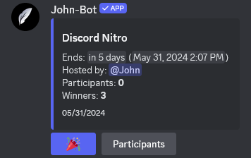

**Video tutorial related to this page:** [Organize a Giveaway on Your Server with John-Bot - Tutorial #8](https://youtu.be/UsfRXtH8Rcg)

# :rocket: Introduction
A giveaway is the perfect way to reward your members by putting a prize at stake and letting chance decide. Indeed, a giveaway is simply a lottery-style contest. Participants can enter via a simple button, and the draw is made at the chosen time.

There are two ways to create a giveaway: one is quick but less customizable, while the other is more customizable but requires more time and precision. Choose the one that suits you best by comparing them, and learn how to set them up.
  Also, discover how to interact with a giveaway to participate, as well as the giveaway management commands.

# :zap: Quick and Simple Method
If you want to create a giveaway quickly and efficiently, choose this method.

First, go to the server where you want to launch the giveaway. Make sure you have administrator permission.
  Then, enter the command /giveaway create. You will have access to several options:
* You must choose the duration of the giveaway, i.e., the period of time before the automatic draw and announcement of the results.
  To do this, enter the number of second·s, minute·s, hour·s, or day·s, followed by the unit (s for second, min for minute, h for hour, and d for day).
* You must choose the number of winners who will be selected to receive the prize at stake. Simply enter an integer greater than 0.
* You must choose the prize you want to award to the winners. The field is completely free; simply enter the name of the prize, whether it is material, virtual, or otherwise.
* Finally, you can choose the channel in which the giveaway should take place if it differs from the channel in which you are entering the command to set up the giveaway. This option is therefore optional; if left blank, the giveaway will be launched directly in the channel where the command was sent.

# :tools: More Complete and Customizable Method
If you want to create a complex and detailed giveaway by integrating original elements, choose this method.

## Access the Dashboard
First, go to John-Bot's dashboard using your preferred method. Learn how to do it: [How to Access the Dashboard](../../guide/base.md#pushpin-access-the-dashboard)

## Access Settings
Then, look for `Giveaways` on the right column, below your server's logo and banner. You will now be on a page where you can view all the giveaways on your server, whether they are completed or ongoing.

## Create and Configure
You will arrive on the page that will allow you to configure your giveaway. Here's how to configure the various parameters:

### Name
In this field, choose a name that can define your giveaway. It will be displayed in the message title and on the dashboard to be able to spot it among the others.

### Send Channel
In this field, choose where the giveaway will be sent and visible to members. After sending the giveaway, you will not be able to change the channel.

### Reward
In this field, choose the prize you want to put up for grabs. The field is completely free; simply enter the name of the prize, whether it is material, virtual, or otherwise. It is not possible to automate the distribution of the prize; you will have to handle it manually.

### End Date
This field allows you to set the exact date and time of the draw. On this date, a message will be automatically sent in response to the original giveaway message to announce the winner(s).

### Number of Winners
In this field, define how many members can be declared winners of the prize at stake.

### Maximum Number of Participants :gem:
In this field, you can choose to limit the number of members who can enter the draw.

### Display Participant List
You can disable
 Find out how this button works in the [direct interaction with the giveaway](../../usage/fonctionnalites/giveaway.md#interaction-directe-avec-le-giveaway) section of this page. 

### Allowed & Ignored Roles
In these two fields, you can restrict the giveaway to certain roles or, conversely, forbid certain roles from participating in the giveaway.
  To do this, select the desired roles from the corresponding dropdown menu.

### Embed
The `embed` section allows you to format the message that will be sent and visible to the member in the channel.
  You can customize it to your liking using the many options available.

### Button :gem:
The `button` section allows you to customize the button that will be attached to the giveaway message and that allows members to participate in the giveaway.
  You can customize it to your liking using the many options available such as color, displayed text, or displayed emoji.

## Finalize and Send
Once your giveaway is fully configured, check that everything is correct and click on the green button located at the top left, `Create & Send`. Your giveaway will be sent and started in the specified channel with all its customizations. It is advisable to write an announcement message to let your members know if the giveaway is being held in honor of an important event.

# :gear: Giveaway Operation
## Giveaway Information
In the embed message, you will find some information related to the giveaway. Here are explanations for each piece of information available on the message.
- **Name or Title**: You can find the giveaway name in the embed title (bold and titled).
- **End Date and Time**: You can find the remaining time as well as the date and time when the giveaway will end. The corresponding field is `Ends:`, located below the title in the body of the embed. The field is renamed to `Ended` once the giveaway is over.
- **Giveaway Author**: You can see the user who initiated the giveaway. Their Discord account is directly identified in the `Launched by:` field.
- **Number of Participants**: You can know the number of members who are registered for the draw in the `Participants:` field.
- **Number of Winners**: You can know the number of members who will be declared winners of the prize after the draw in the `Winners` field. This field then displays the winner(s) by mention.

## Direct Interaction with the Giveaway
### Participate Button
You can enter the draw with the customizable button by the giveaway author located below the giveaway embed, to the left of the `Participants` button.

### Participants Button
You can view the list of people registered for the draw by clicking on the `Participants` button located below the giveaway embed, to the right of the participation button.
 Find out how to configure this button in the [create and configure](../../usage/fonctionnalites/giveaway.md#créer-et-configurer) section of this page. 

## Commands
| Command            | Description                                                   |
| ------------------- | ------------------------------------------------------------- |
| /giveaway create    | Starts a giveaway.                                            |
| /giveaway delete    | Deletes a giveaway.                                           |
| /giveaway end       | Ends a giveaway.                                              |
| /giveaway list      | Displays the list of giveaways on the server.                 |
| /giveaway reroll    | Chooses new winners for a giveaway.                           |