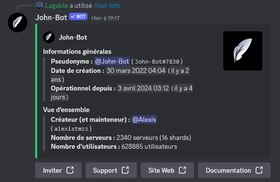
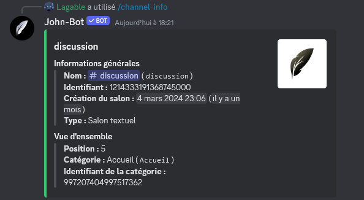
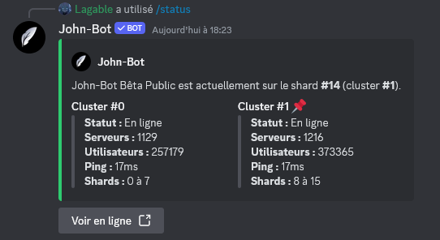
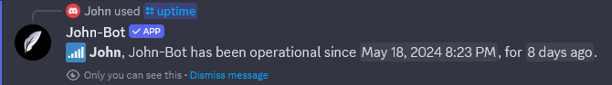
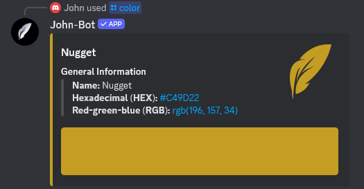

# :rocket: Introduction
If you want to get information about a server, a user... or even the photo or banner of any user or server and much more, John-Bot's information commands are here for you! Discover all of these commands described precisely on this page.

# :clipboard: List of Commands
| Command | Description | Example |
| -------- | ----------- | ------- |
| /bot-info | Displays some information about John-Bot. |  |
| /user avatar | Displays the avatar of a user. |  |
| /user banner | Displays the banner of a user. |  |
| /user info | Displays some information about a user. |  |
| /server icon | Displays the server icon. |  |
| /server banner | Displays the server banner. |  |
| /server info | Displays some information about the server. |  |
| /server members | Displays some information about the server members. |  |
| /role info | Displays some information about a role. |  |
| /role color | Displays the color of a role. |  |
| /channel-info | Displays some information about a channel. |  |
| /ping | Displays the latency of John-Bot. |  |
| /status | Displays the status of John-Bot's shards. |  |
| /uptime | Displays how long John-Bot has been operational. |  |
| /color | Displays some information about a color. |  |