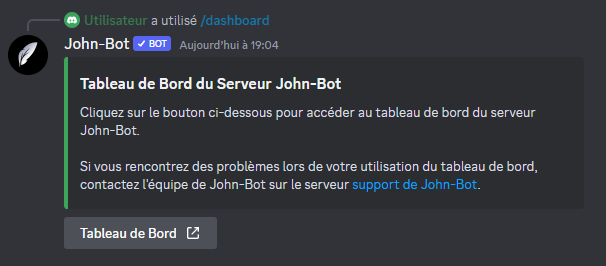
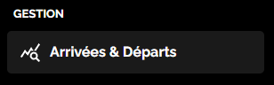
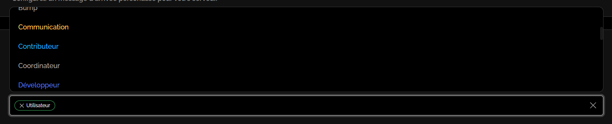
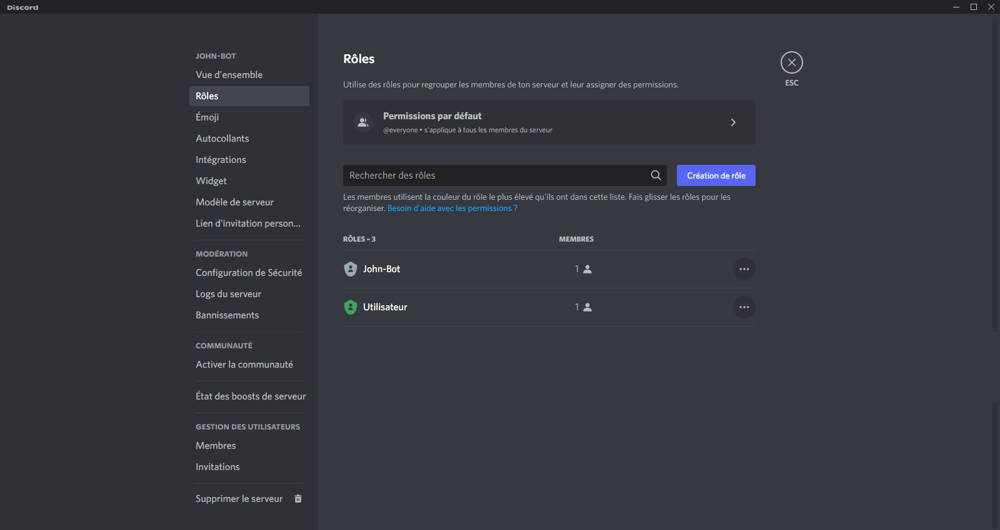

# Système de Rôles d'Arrivée

## :airplane\_small: Introduction

Pour débuter la configuration du système de rôles d'arrivée, vous devez avant tout vous rendre sur le tableau de bord de votre serveur, pour ce faire, exécutez la commande [**/dashboard**](https://johnbot.app/dashboard) dans un salon textuel puis cliquez sur le bouton "Tableau de Bord" en dessous de l'embed (voir image #1). Une fois cela fait, rendez vous dans la catégorie "Arrivées et Départs" du tableau de bord (voir image #2).

<figure><figcaption>
Image #2
</figcaption></figure>

## :busts\_in\_silhouette: Configurer les rôles d'arrivée

Afin de configurer un ou plusieurs rôle/s d'arrivée, rendez vous dans la section "Rôles d'Arrivée" puis cliquez sur le menu de sélection "Rôle·s d'arrivée·s" (voir image #3) et sélectionnez le ou les rôle/s d'arrivée désiré/s.

<figure><figcaption>
Image #3
</figcaption></figure>


Assurez-vous que rôle d'intégration de John-Bot soit en haut de votre ou vos rôles d'arrivée. (voir image #4)


