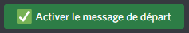
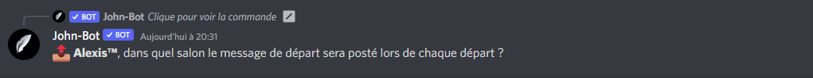
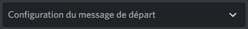
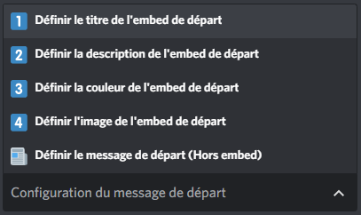
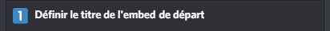
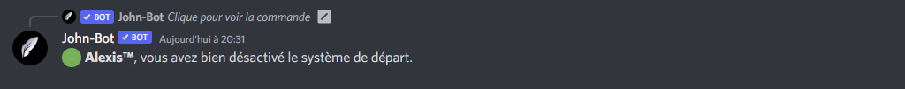

# Messages d'Arrivée


La page du messages d'arrivée est obsolète ! Si vous avez des questions ou besoin d'aide dans votre configuration des messages d'arrivée, faites nous en part sur le  [**serveur support de John-Bot**](https://discord.com/invite/abePbS7QKY) !


## :wave: Mise en place du système de messages d'arrivée

Pour débuter la configuration du système d'arrivée, vous devez ajouter John-Bot à votre serveur pour ce faire consultez le [**guide d'ajout de John-Bot**](broken-reference), une fois cela fait exécutez la commande `/panel join` dans un salon textuel afin d'avoir accès au panel de configuration du système d'arrivée.\
\
Pour ce qui de l'activation du système d'arrivée, vous n'avez qu'à cliquer sur le bouton "Activer le message d'arrivée" (voir image #1) une fois le bouton enclenché, vous devez indiquer le salon qui recevra les messages d'arrivée (voir image #2). Voilà ! Le système d'arrivée est activé sur votre serveur ! &#x20;


Assurez-vous que John-Bot ait la permission d'envoyer le message d'arrivée dans le salon configuré.


## :art: Configuration du message d'arrivée

C'est super d'activer le système d'arrivée, mais entre nous, le message de base n'est pas bien beau. C'est là qu'entre en jeu la configuration du message d'arrivée ! Si ce n'est pas déjà fait, vous devez exécuter la commande `/panel join` dans un salon textuel afin d'avoir accès au panel de configuration du système d'arrivée. \
\
Une fois la commande exécutée, vous devez vous servir du menu (voir image #3) de cette dernière afin de configurer votre message d'arrivée à votre guise.\
\
Pour configurer un élément de votre message d'arrivée, vous devez sélectionner l'option (voir image #4) que vous souhaitez configurer à votre manière.\
\
Pour mon exemple, je vais personnaliser le titre de mon embed d'arrivée, je vais donc sélectionner la première option (voir image #5) une fois l'option sélectionnée, je vais devoir indiquer mon propre titre qui donc, remplacera celui de base (voir image #6). \
\
La manipulation indiqué l'exemple ci-dessus, reste la même pour toutes les autres options de configuration de votre message d'arrivée.


Lors la configuration de votre message d'arrivée est très fortement recommandé de consulté le [**guide des variables**](../autres/variables.md).


## :x: Désactivation du système d'arrivée

Le système d'arrivée ne vous convient plus, et vous vous demandez comment le désactiver ? Si c'est le cas vous en saurez plus après avoir lu ce rapide texte. Si ce n'est pas déjà fait, vous devez exécuter la commande `/panel join` dans un salon textuel afin d'avoir accès au panel de configuration du système d'arrivée. \
\
Une fois le panel de configuration sous la main, vous n'avez qu'à cliquer sur le bouton "Désactiver le message d'arrivée" (voir image #7) une fois le bouton enclenché, John-Bot confirmera la désactivation du système d'arrivée (voir image #8).


Si le système d'arrivée ne vous convient plus, notre équipe se fera un plaisir de savoir pourquoi, afin de pouvoir l'améliorer !


