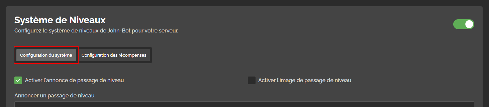
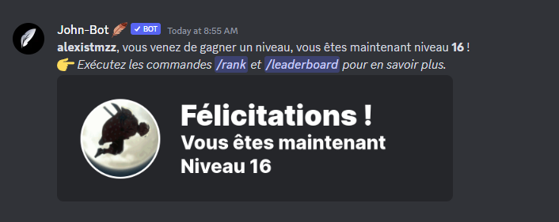
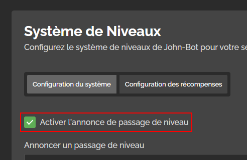
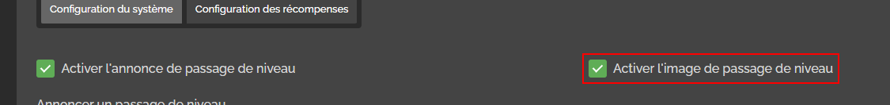
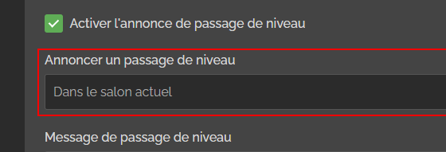

# Système de Niveaux

## :rocket: Introduction


Pour accéder au tableau de bord, il va de soit de vous y connecter avec votre compte Discord.


Avant de configurer le système de niveaux pour votre serveur, vous devez, avant tout, vous rendre sur le tableau de bord de votre serveur. Pour ce faire, exécutez la commande /dashboard dans un salon textuel, puis cliquez sur le bouton "Tableau de Bord" en dessous de l'embed. Une fois cela fait, rendez-vous dans la catégorie "Niveaux" du tableau de bord.


Avant de commencer la configuration du système de Niveaux, pensez à l'activer à l'aide du "Slider" à droite du module.


## :gear: Configuration du système

### C'est quoi ?

La configuration du système, c'est la section du module ou vous pourrez configurer le système de Niveaux. Pour savoir qu'est-ce que la section "Configuration des récompenses", référez vous à [cette partie](systeme-de-niveaux.md#introduction) de l'article.

### Commencer la configuration

Pour débuter la configuration du système, rendez-vous dans la section "Configuration du système" du module.

<figure><figcaption>
Sélection de la section "Configuration du système" du module
</figcaption></figure>

Une fois dans cette section, vous allez pouvoir débuter la configuration du système.&#x20;

### L'annonce de passage de niveau

L'annonce de passage de niveau, c'est le message qui sera envoyé lorsqu'un membre passe d'un niveau à un autre. Vous pouvez voir un exemple d'annonce ci-dessous. ⬇️

<figure><figcaption>
Exemple d'annonce de passage de niveau
</figcaption></figure>

#### Statut de l'annonce de passage de niveau

Vous pouvez gérer le statut de l'annonce très simplement avec la casse à cocher "Activer l'annonce de passage de niveau". Lorsqu'elle est désactivée, l'annonce ne sera pas envoyée lors d'un passage de niveau d'un membre.

<figure><figcaption>
Case à cocher "Activer l'annonce de passage de niveau"
</figcaption></figure>

#### Statut de l'image de passage de niveau

L'image de passage de niveau, c'est l'image envoyée avec le message d'annonce de passage de niveau, vu [ici](systeme-de-niveaux.md#lannonce-de-passage-de-niveau). Encore une fois, vous pouvez gérer le statut de l'image avec la case à cocher "Activer l'image de passage de niveau". Lorsqu'elle est désactivée, l'annonce de passage de niveau sera envoyée sans l'image.

<figure><figcaption>
Case à cocher "Activer l'image de passage de niveau"
</figcaption></figure>

#### Salon d'envoie de l'annonce de passage de niveau

L'annonce de passage de niveau peut être envoyer dans un salon défini ou dans le salon actuel ou le membre passe de niveau. Vous pouvez configurer ce salon avec le menu de sélection "Annoncer un passage de niveau".

<figure><figcaption>
Menu de sélection "Annoncer un passage de niveau"
</figcaption></figure>
