# Système de Tickets


La page du système de tickets est actuellement en cours de création, cela prend du temps ! Si vous avez une question sur le système de ticket venez la poser sur le [**serveur support de John-Bot**](https://discord.com/invite/abePbS7QKY) !


## :question: Explication

Pour utiliser le système de tickets de John-Bot vous devez d'abord créer un/des panneau/x pour ce faire référez vous au guide [**Créer un panneau**](systeme-de-tickets.md#creer-un-panneau) une fois votre/vos panneau/x créé/s, vous devez cette fois-ci, créer un embed qui sera envoyé dans votre salon support et qui contiendra votre/vos différent/s panneau/x, pour ce faire, consultez le guide [**Créer un embed**](systeme-de-tickets.md#creer-un-embed). Vous pouvez aussi créer un modèle "form" qui devra être rempli avant la création de chaque ticket, pour ce faire référez vous au guide [**Créer un modèle**](systeme-de-tickets.md#creer-un-modele) puis [**Modèle lié au panneau**](systeme-de-tickets.md#modele-lie-au-panneau).

## :rocket: Introduction

Avant de configurer le système de tickets, vous devez avant tout vous rendre sur le tableau de bord de votre serveur, pour ce faire, exécutez la commande [**/dashboard**](https://johnbot.app/dashboard) dans un salon textuel puis cliquez sur le bouton "Tableau de Bord" en dessous de l'embed. Une fois cela fait, rendez vous dans la catégorie "Tickets" du tableau de bord.

## :earth\_americas: Configuration Globale

### Logs

Les logs du système de tickets sont très utiles, elles permettent, lorsqu'un ticket est fermé d'avoir quelques informations sur ce dernier (voir image #1). Afin d'activer les logs, rien de plus simple il vous suffit de cocher la case "Activer les logs" (voir image #2) puis d'indiquer un salon d'envoie des logs (voir image #3) puis, sauvegarder via la notification de modifications (voir image #4)

<figure>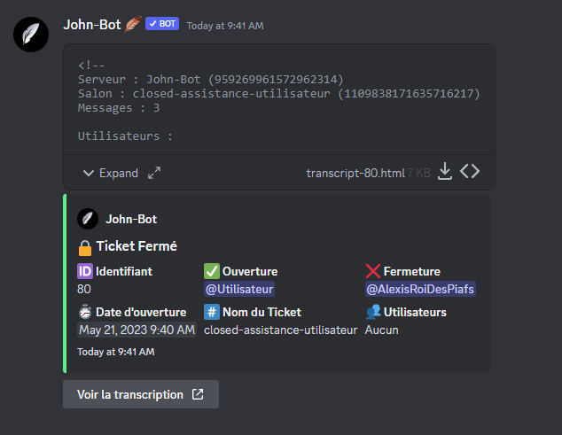<figcaption>
image #1
</figcaption></figure>

<figure>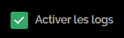<figcaption>
Image #2
</figcaption></figure>

<figure>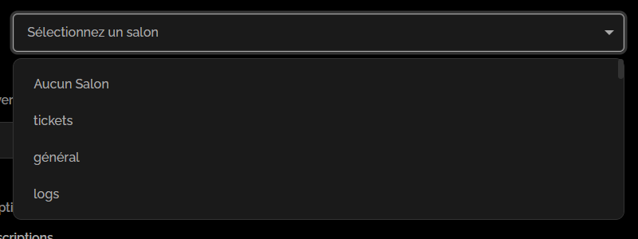<figcaption>
Image #3
</figcaption></figure>

<figure>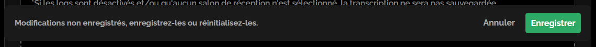<figcaption>
Image #4
</figcaption></figure>

### Limite de Tickets

La limite de tickets du système de tickets définie combien de tickets peuvent être ouvert en simultané par un membre. Afin de configurer cette limite, il vous suffit simplement de choisir une option parmi le menu de sélection de la limite de tickets (voir image #5), puis, sauvegarder.

<figure><figcaption>
Image #5
</figcaption></figure>

### Transcriptions


Si les logs et/ou qu'aucun salon de logs n'est défini, les transcriptions seront désactivées.


Les transcriptions de tickets peuvent s'avérer très pratique, afin des les activer, il vous suffit de cocher la case "Activer les transcriptions" (voir image #6) puis sauvegarder.

<figure>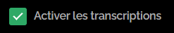<figcaption>
Image #6
</figcaption></figure>

### Rôles d'exclusion

Lorsqu'un membre possède un rôle d'exclusion, il sera impossible pour lui de créer un ticket. Pour les configurer, il vous suffit simplement de choisir un ou plusieurs rôle/s parmi le menu de sélection des rôles d'exclusion (voir image #7), puis, sauvegarder.

<figure>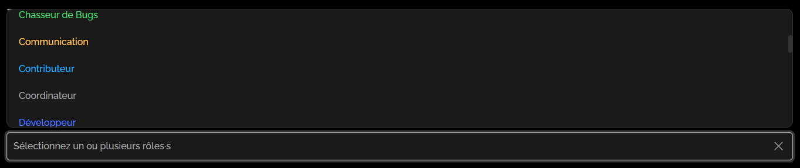<figcaption>
Image #7
</figcaption></figure>

## :jigsaw: Créer un panneau

Afin de créer un panneau, il vous suffit d'appuyez sur la case "Créer un panneau" (voir image #8).

<figure><figcaption>
Image #8
</figcaption></figure>

### Configuration du panneau

#### Nom du panneau


Si vous souhaitez avoir des panneaux triés dans un ordre bien précis, indiquez A, B, C etc.. devant les noms de panneau afin qu'ils soient triés selon votre ordre sur l'embed.


Afin de configurer un nom pour le panneau, rendez vous dans la champ de texte "Nom du panneau" (voir image #9) puis indiquez un nom.

<figure>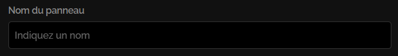<figcaption>
Image #9
</figcaption></figure>

#### Nom du ticket

Afin de définir un nom pour le ticket lors de sa création, rendez vous dans la champ de texte "Nom du ticket" puis indiquez le nom du ticket (voir image #10). De plus, lors de la configuration du nom du ticket, il est conseiller de se référer au [**guide des variables**](../autres/variables.md) afin d'utiliser les variables lors de votre configuration.

<figure>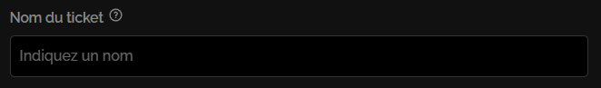<figcaption>
Image #10
</figcaption></figure>

#### Rôles de l'équipe d'assistance

Pour configurer un ou plusieurs rôles d'assistance, rendez vous dans la case "Rôle·s de l'équipe d'assistance" puis cliquez sur le menu de sélection et sélectionnez tous les rôles de l'équipe d'assistance souhaités (voir image #11).

<figure>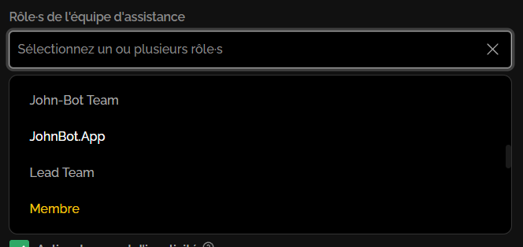<figcaption>
Image #11
</figcaption></figure>

#### Rôle·s de l'équipe responsable

Les membres ayant un rôle de l'équipe responsable sont considérés comme responsable de l'équipe et ont donc un passe droit sur certaines options comme "La gestion du ticket exclusive du ticket". Pour configurer un ou plusieurs rôles d'assistance, rendez vous dans la case "Rôle·s de l'équipe responsable" puis effectuer les mêmes étapes que dans la partie [**Configurer un ou plusieurs rôles d'assistance**](systeme-de-tickets.md#roles-de-lequipe-dassistance).

#### Rôles à mentionner lors de l'ouverture&#x20;

Afin de configurer un ou plusieurs rôles à mentionner lors de la création du ticket, rendez vous dans la case "Rôle·s à mentionner lors de l'ouverture" puis effectuer les mêmes étapes que dans la partie [**Configurer un ou plusieurs rôles d'assistance**](systeme-de-tickets.md#roles-de-lequipe-dassistance).

#### Catégorie de création des tickets

Pour configurer une catégorie de création des tickets rendez vous dans la case "Catégorie de création des tickets" puis cliquez sur le menu de sélection et sélectionnez la catégorie souhaitée (voir image #12).&#x20;

<figure><figcaption>
Image #12
</figcaption></figure>

#### Modèle lié au panneau

Pour définir un modèle lié au panneau, vous devez d'abord créer un modèle, pour ce faire référez vous au [**guide de création d'un modèle**](systeme-de-tickets.md#creer-un-modele). Une fois votre modèle mis en place, vous n'avez qu'à cliquer sur le menu de sélection et sélectionner le modèle souhaité (voir image #13).&#x20;

<figure><figcaption>
Image #13
</figcaption></figure>

### Options du panneau

#### Activer l'assignation des tickets

Afin d'activer l'assignation "claim" des tickets, vous n'avez qu'à cocher la case "Activer l'assignation des tickets" (voir image #14).

<figure>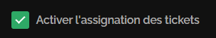<figcaption>
Image #14
</figcaption></figure>

#### Activer le rappel d'inactivité

Le rappel d'inactivité envoie un message dans un ticket qui n'a pas reçu de nouveau message depuis une semaine ou plus. Ce rappel n'est envoyé qu'une fois par ticket et a pour but de rappeler la présence d'un ticket tombé aux oubliettes (voir image #15). Afin d'activer ce rappel, vous n'avez qu'à cocher la case "Activer le rappel d'inactivité" (voir image #16)

<figure>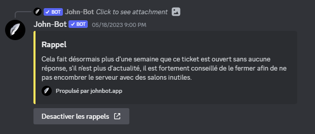<figcaption>
Image #15
</figcaption></figure>

<figure>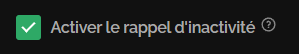<figcaption>
Image #16
</figcaption></figure>

#### Activer l'avertissement en message privé

L'avertissement en message privé envoie un message privé au membre ayant créé le ticket, ce message contient quelques informations sur le ticket (voir image #17). Afin d'activer ce rappel, vous n'avez qu'à cocher la case "Activer l'avertissement en message privé" (voir image #18)

<figure><figcaption>
Image #17
</figcaption></figure>

<figure>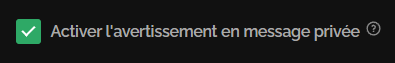<figcaption>
Image #18
</figcaption></figure>

#### Activer la gestion du ticket exclusive

Si la gestion du ticket exclusive est activée, lorsqu'un ticket est assigné à un membre de l'équipe d'assistance, il sera impossible pour les autres membres de l'équipe d'écrire dans le ticket, afin de ne pas nuire à la compréhension du ticket. Pour activer la gestion du ticket exclusive, vous n'avez qu'à cocher la case "Activer la gestion du ticket exclusive" (voir image #19)

<figure><figcaption>
Image #19
</figcaption></figure>

### Bouton du panneau

#### Label du bouton

Le label du bouton, c'est le texte affiché sur ce dernier (voir image #20). Afin de configurer ce court texte, rendez dans le champ de texte "Label du bouton" (voir image #21) puis indiquez le label souhaitez.

<figure><figcaption>
Image #20
</figcaption></figure>

<figure>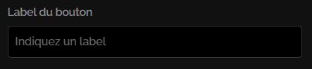<figcaption>
Image #21
</figcaption></figure>

#### Description du bouton

La description du bouton, c'est le texte affiché sous le label de l'option dans un menu de sélection (voir image #22). Afin de configurer ce court texte, rendez dans le champ de texte "Description du bouton" (voir image #23) puis indiquez la description souhaitez.

<figure>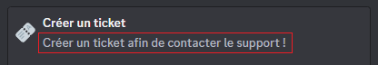<figcaption>
 Image #22
</figcaption></figure>

<figure>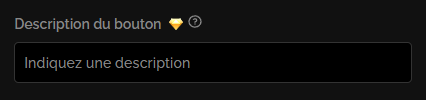<figcaption>
Image #23
</figcaption></figure>

#### Émoji du bouton


Pour utiliser un émoji personnalisé, vous n'avez qu'à indiquer l'identifiant de cet émoji dans le champ de texte. (<:JohnBot:1011466005626748928> ou 1011466005626748928)


L'émoji du bouton, c'est l'émoji affiché au côté du texte (voir image #24). Pour le configurer, rendez dans le champ de texte "Émoji du bouton" (voir image #25) puis indiquez l'émoji souhaitez, pour s'y faire vous pouvez vous aider du sélecteur d'émoji (voir image #26).

<figure>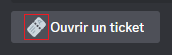<figcaption>
Image #24
</figcaption></figure>

<figure><figcaption>
Image #25
</figcaption></figure>

<figure>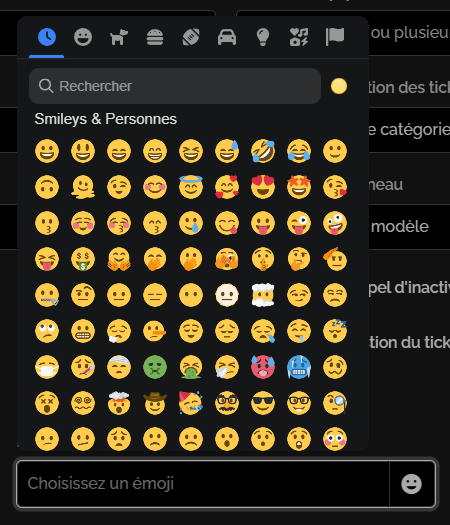<figcaption>
Image #26
</figcaption></figure>

#### Couleur du bouton

Afin de définir la couleur du bouton, rendez vous dans la section "Couleur du bouton" (voir image #27) puis cliquez sur la couleur souhaitez.

<figure>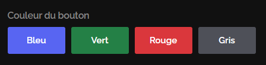<figcaption>
Image #27
</figcaption></figure>

### Permissions du panneau

#### Liste des permissions :

* **Créer un ticket**\
  Permission de créer un ticket. Par défaut : Tout le monde.
* **Réclamer le ticket**\
  Permission de réclamer "claim" le ticket. Par défaut : Membres ayant les rôles de l'équipe d'assistance.&#x20;
* **(Re)Ouvrir le ticket**\
  Permission de (re)ouvrir le ticket fermé. Par défaut : Tout le monde.&#x20;
* **Fermer le ticket**\
  Permission de fermer le ticket. Par défaut : Tout le monde.&#x20;
* **Supprimer le ticket**\
  Permission de supprimer le ticket. Par défaut : Membres ayant les rôles de l'équipe d'assistance.&#x20;

#### Rôles des permissions d'interaction

Afin de configurer les permissions, rendez vous dans la section "Permissions du panneau" (voir image #28) puis dans le menu de sélection de la permission souhaité (voir image #29) et sélectionnez tous les rôles souhaités.

<figure>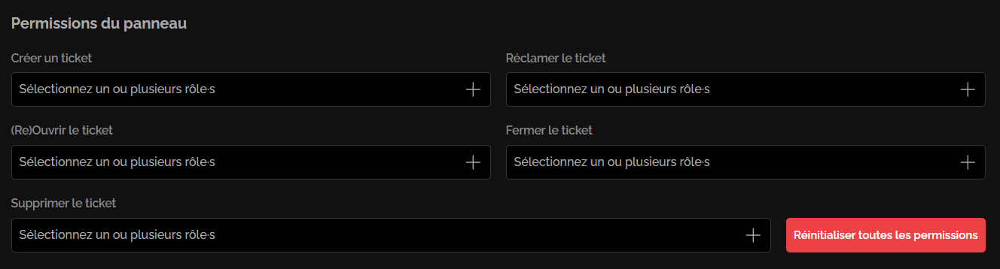<figcaption>
Image #28
</figcaption></figure>

<figure><figcaption>
Image #29
</figcaption></figure>

#### Réinitialiser les permissions

Si vous souhaitez revoir vos permissions et ne pas perdre de temps à désélectionner tous les rôles un par un, vous n'avez qu'à cliquer sur le bouton "Réinitialiser toutes les permissions" (voir image #30).

<figure><figcaption>
Image #30
</figcaption></figure>

### Message d'ouverture


Tout au long de votre configuration du message d'ouverture, vous pouvez utiliser les variables, disponible dans le [**guide des variables**](../autres/variables.md).


Pour configurer le message d'ouverture, rendez vous dans la section "Message d'ouverture" du sélecteur (voir image #31).

<figure>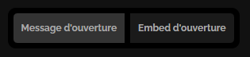<figcaption>
Image #31
</figcaption></figure>

#### Contenu du message d'ouverture

Le contenu du message d'ouverture, c'est le texte qui va s'afficher en haut de l'embed d'ouverture (voir image #32). Afin de le configurer, rendez vous dans la zone de texte "Contenu du message d'ouverture" (voir image #33), puis indiquez le message d'ouverture souhaité.

<figure><figcaption>
Image #32
</figcaption></figure>

<figure>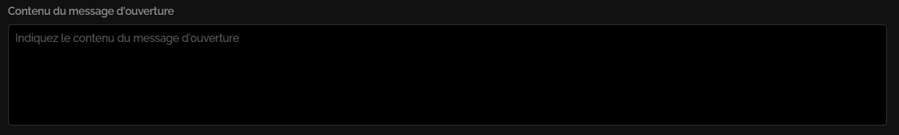<figcaption>
Image #33
</figcaption></figure>

### Embed d'ouverture


Tout au long de votre configuration de l'embed d'ouverture, vous pouvez utiliser les variables, disponible dans le [**guide des variables**](../autres/variables.md).


Pour configurer l'embed d'ouverture, rendez vous dans la section "Embed d'ouverture" du sélecteur (voir image #34).

<figure>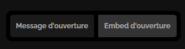<figcaption>
Image #34
</figcaption></figure>

#### Activer l'embed d'ouverture

Afin d'activer l'embed d'ouverture, vous n'avez qu'à cocher la case "Activer l'embed d'ouverture" (voir image #35).

<figure>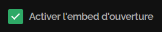<figcaption>
Image #35
</figcaption></figure>

#### Titre de l'embed d'ouverture

Le titre de l'embed d'ouverture, c'est le titre qui va s'afficher en premier dans l'embed d'ouverture (voir image #36). Afin de le configurer, rendez vous dans le champ de texte "Titre de l'embed d'ouverture" (voir image#37) puis indiquez le titre souhaité.

<figure>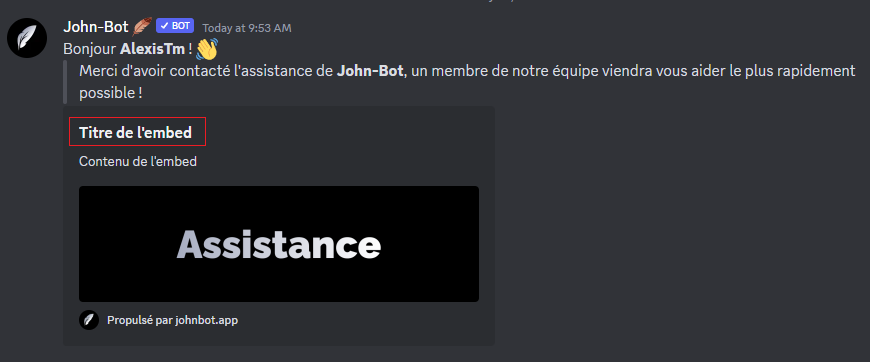<figcaption>
Image #36
</figcaption></figure>

<figure>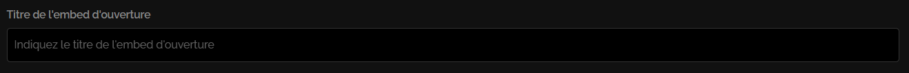<figcaption>
Image #37
</figcaption></figure>

#### Contenu de l'embed d'ouverture

Le contenu de l'embed d'ouverture, c'est la description de l'embed qui va s'afficher dans le milieu dans l'embed d'ouverture (voir image #38). Afin de configurer le contenu de l'embed, rendez vous dans la zone de texte "Contenu de l'embed d'ouverture" (voir image #39) puis indiquez le contenu souhaité.

<figure>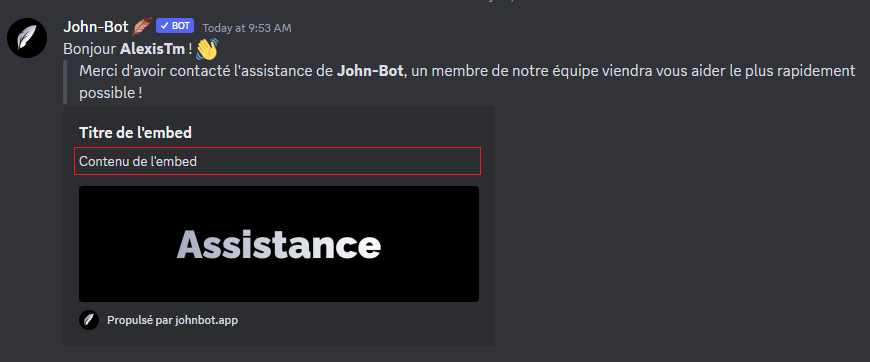<figcaption>
Image #38
</figcaption></figure>

<figure>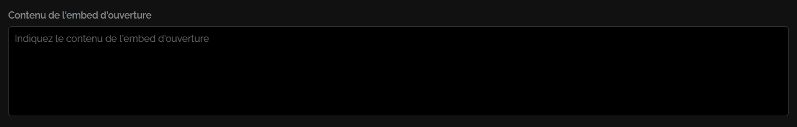<figcaption>
Image #39
</figcaption></figure>

#### Couleur de l'embed d'ouverture

La couleur de l'embed d'ouverture, c'est la petite bordure à gauche de l'embed d'ouverture (voir image #40). Pour configurer cette couleur, rendez vous dans la section "Couleur de l'embed d'ouverture" puis, servez vous soit des petites pastilles de couleur (voir image #41) ou encore du sélecteur de couleur (voir image #42).

<figure>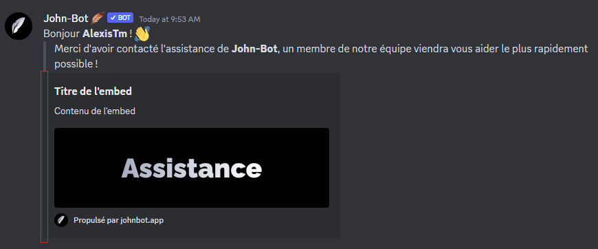<figcaption>
Image #40
</figcaption></figure>

<figure>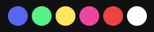<figcaption>
Image #41
</figcaption></figure>

<figure>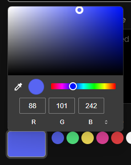<figcaption>
Image #42
</figcaption></figure>

#### Image de l'embed d'ouverture

L'image l'embed d'ouverture, c'est la bannière de l'embed qui va s'afficher en bas de l'embed d'ouverture (voir image #43). Afin de configurer cette image, rendez vous dans le champ de texte "Lien de l'image de l'embed d'ouverture" (voir image #44) puis indiquez le lien de l'image souhaité.

<figure><figcaption>
Image #43
</figcaption></figure>

<figure>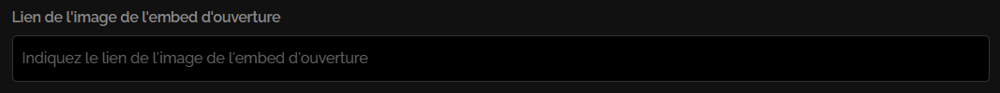<figcaption>
Image #44
</figcaption></figure>

## :pencil2: Modifier un panneau

Pour modifier un panneau, il vous suffit d'appuyer le sur le bouton "Modifier" à droite du panneau (voir image #45) puis suivre les mêmes indications que pour la [**création d'un panneau**](systeme-de-tickets.md#creer-un-panneau).

<figure>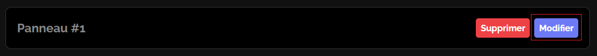<figcaption>
Image #45
</figcaption></figure>

## :wastebasket: Supprimer un panneau


Lorsque vous supprimez un panneau, toutes ses données associées seront supprimées et sont irrécupérables.


Pour supprimer un panneau, il vous suffit d'appuyer le sur le bouton "Supprimer" à droite du panneau (voir image #46).

<figure>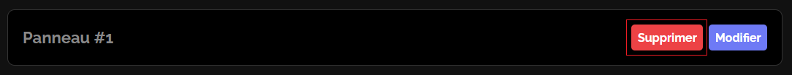<figcaption>
Image #46
</figcaption></figure>

## :man\_raising\_hand: Créer un embed

Afin de créer un embed, il vous suffit d'appuyez sur la case "Créer un embed" (voir image #47).

<figure>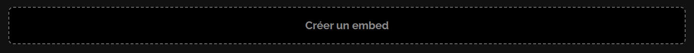<figcaption>
Image #47
</figcaption></figure>

### Configuration de l'embed

#### Salon d'envoie de l'embed

Le salon d'envoie de l'embed, c'est le salon de lequel l'embed support sera envoyé. Afin de le configurer, vous n'avez qu'à cliquer sur le menu de sélection "Salon d'envoi de l'embed" et sélectionner le salon souhaité (voir image #48).&#x20;

<figure>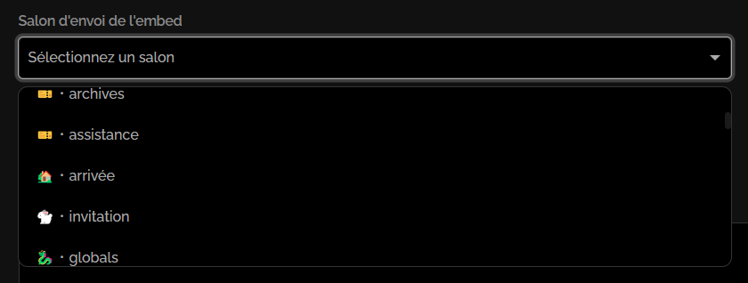<figcaption>
Image #48
</figcaption></figure>

#### Panneaux liés à l'embed

Les panneaux liés c'est les boutons qui seront sous l'embed et qui permettront d'interagir avec les panneaux. Pour les configurer, rendez vous dans le menu de sélection "Panneau·x lié·s à l'embed" et sélectionner les panneaux souhaités (voir image #49).&#x20;

<figure>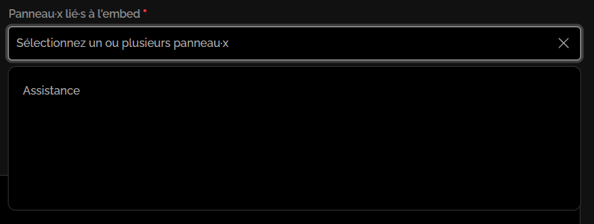<figcaption>
Image #49
</figcaption></figure>

### Personnalisation de l'embed

#### Style d'affichage des panneaux

Le style d'affichage des panneaux va déterminer comment les panneaux seront affichés sur l'embed, en menu de sélection (voir image #50) ou en boutons (voir image #51). Pour configurer ce style d'affichage, rendez vous dans le menu de sélection "Style d'affichage des panneaux" et sélectionner le style voulu (voir image #52).

<figure>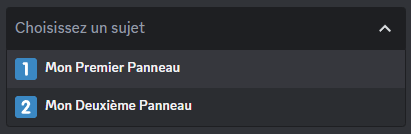<figcaption>
Image #50
</figcaption></figure>

<figure>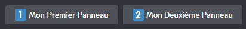<figcaption>
Image #51
</figcaption></figure>

<figure>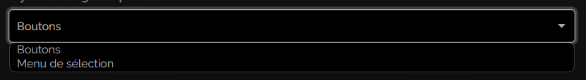<figcaption>
Image #52
</figcaption></figure>

#### Titre de l'embed

Comme indiqué dans la partie "[**Titre de l'embed d'ouverture**](systeme-de-tickets.md#titre-de-lembed-douverture)" de la section "[**Embed d'ouverture**](systeme-de-tickets.md#embed-douverture)", le titre de l'embed c'est ce qui sera affiché en haut de l'embed. Pour le configurer, rendez vous dans le champ de texte "Titre de l'embed" (voir image #53) puis indiquez le titre souhaité.

<figure>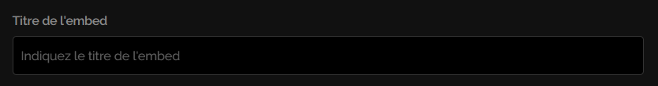<figcaption>
Image #53
</figcaption></figure>

#### Contenu de l'embed

Comme indiqué dans la partie "[**Contenu de l'embed d'ouverture**](systeme-de-tickets.md#contenu-de-lembed-douverture)" de la section "[**Embed d'ouverture**](systeme-de-tickets.md#embed-douverture)", le contenu de l'embed c'est ce qui sera affiché vers le milieu de l'embed. Pour configurer ce contenu, rendez vous dans la zone de texte "Contenu de l'embed" (voir image #54) puis indiquez le texte souhaité.

<figure>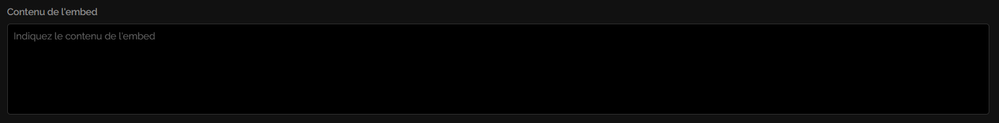<figcaption>
Image #54
</figcaption></figure>

#### Couleur de l'embed

Comme indiqué dans la partie "[**Couleur de l'embed d'ouverture**](systeme-de-tickets.md#couleur-de-lembed-douverture)" de la section "[**Embed d'ouverture**](systeme-de-tickets.md#embed-douverture)", la couleur de l'embed c'est ce qui sera affiché sur la bordure située sur le côté de l'embed. Pour configurer cette couleur, rendez vous dans le champ de texte "Couleur de l'embed" (voir image #55) puis indiquez la couleur souhaitée.

<figure>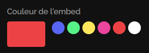<figcaption>
Image #55
</figcaption></figure>

#### Image de l'embed

Comme indiqué dans la partie "[**Image de l'embed d'ouverture**](systeme-de-tickets.md#image-de-lembed-douverture)" de la section "[**Embed d'ouverture**](systeme-de-tickets.md#embed-douverture)", l'image de l'embed c'est ce qui sera affiché en bas de l'embed. Pour configurer cette image, rendez vous dans le champ de texte "Image de l'embed" (voir image #56) puis indiquez le lien de l'image souhaitée.

<figure>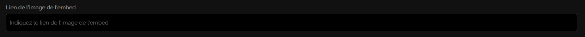<figcaption>
Image #56
</figcaption></figure>

## :mailbox\_with\_mail: Envoyer un embed


Avant d'envoyer l'embed assurez vous d'avoir indiqué un salon d'envoie, si aucun salon n'est défini, consulter [**Comment définir un salon d'envoie**](systeme-de-tickets.md#salon-denvoie-de-lembed).


Pour envoyer un embed dans son salon support, il vous suffit d'appuyer sur le bouton "Envoyer l'embed" à droite de l'embed (voir image #57).

<figure>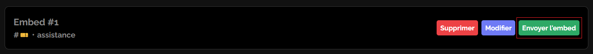<figcaption>
Image #57
</figcaption></figure>

## :pencil2: Modifier un embed

Pour modifier un embed, il vous suffit d'appuyer le sur le bouton "Modifier" à droite de l'embed (voir image #58) puis suivre les mêmes indications que pour la [**création d'un** ](systeme-de-tickets.md#creer-un-panneau)[**embed**](systeme-de-tickets.md#creer-un-embed).

<figure><figcaption>
Image #58
</figcaption></figure>

## :wastebasket: Supprimer un embed


Lorsque vous supprimez un embed, toutes ses données associées seront supprimées et sont irrécupérables.


Pour supprimer un embed, il vous suffit d'appuyer le sur le bouton "Supprimer" à droite de l'embed (voir image #59).

<figure><figcaption>
Image #59
</figcaption></figure>

## :earth\_americas: Créer un modèle

## :earth\_americas: Modifier un modèle

## :earth\_americas: Supprimer un modèle

## :toolbox: Commandes du système de tickets 

Les commandes du système de tickets sont un moyen alternatif à la gestion des tickets.

### :busts\_in\_silhouette: Add

La commande Add permet d'ajouter un membre au ticket (voir image #x).

Syntaxe de la commande : /add \<Membre>
