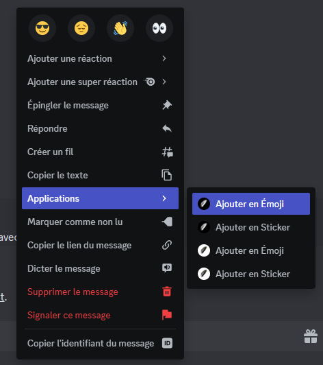

# Emoji Add

La commande Emoji Add permet d'ajouter un emoji au serveur. (voir image #1). La commande Emoji Add est aussi utilisable en menu contextuel (voir image #2).

Syntaxe de la commande : /emoji add \<nom> \<emoji ou image>

<figure><figcaption>
Image #2
</figcaption></figure>
