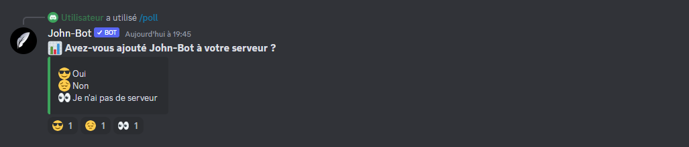
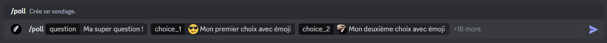

# Poll


Vous pouvez aussi utiliser des émojis personnalisés pour chacune de vos question ! Pour ce faire, vous n'avez qu'à indiqué l'émoji devant la question (voir image #2).


La commande Poll permet de créer un sondage. (voir image #1).

Syntaxe de la commande : /poll \<question>

<figure><figcaption>
Image #2
</figcaption></figure>
