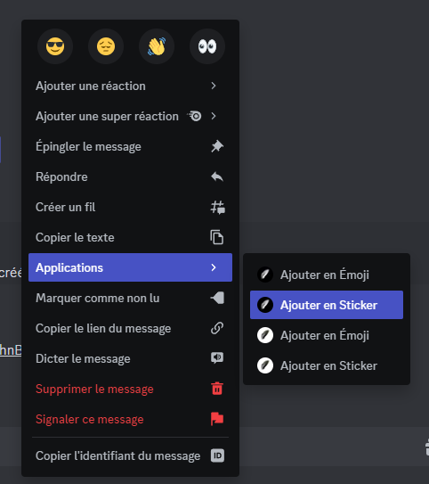

# Sticker Add

La commande Sticker Add permet d'ajouter un autocollant au serveur. (voir image #1). La commande Emoji Add est aussi utilisable en menu contextuel (voir image #2).

Syntaxe de la commande : /sticker add \<nom> \<emoji ou image>

<figure><figcaption></figcaption></figure>
