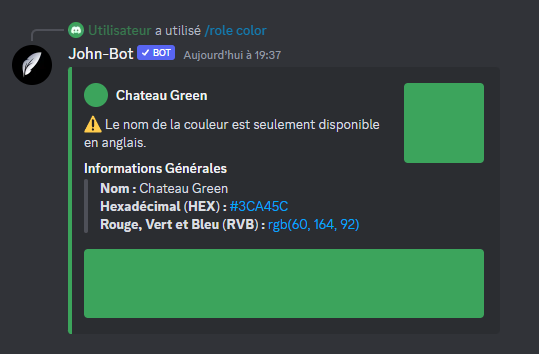

# Role Color

La commande Role Color permet d'afficher la couleur d'un rôle et quelques informations la concernant. (voir image #1).

Syntaxe de la commande : /role color \[@ ou identifiant du rôle]

