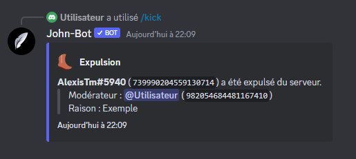

# Kick


Vous devez avoir la permission d'expulser des utilisateurs pour utiliser cette commande.


La commande Kick permet lorsqu'elle est exécutée correctement d'expulser un utilisateur du serveur ou elle est exécutée (voir image #1).

Syntaxe de la commande : /kick \<utilisateur> \[raison] \[alert]

