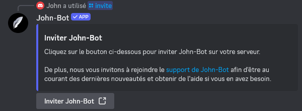

**Tutoriel vidéo lié à cette page :** [Ajouter John-Bot à son serveur Discord - Tutoriel #1](https://jnbt.xyz/fr/tutorials/add)

# :link: Accéder à la page d'invitation
Pour ajouter John-Bot à votre serveur Discord, rendez-vous sur la page d'invitation de John-Bot. 
Vous pouvez y accéder de différentes manières :
* Via le site web puis le bouton "Ajouter à Discord" ;
* Via la commande `/invite` sur un serveur possédant le bot (voir image) ;
* Via le lien direct : [https://jnbt.xyz/invite](https://jnbt.xyz/invite/docs)

# :envelope: Processus d'invitation
Une fois sur la page d'invitation, sélectionnez le serveur sur lequel vous souhaitez ajouter John-Bot, puis cliquez sur "Continuer". Assurez-vous que la permission "Administrateur" est correctement attribuée, puis validez en cliquant sur "Autoriser". Il se peut que vous deviez entrer votre code d'authentification à deux facteurs ([Support sur l'A2F](https://support.discord.com/hc/fr/articles/219576828-Mise-en-place-de-l-authentification-multifacteurs)) ou valider un CAPTCHA pour prouver que vous n'êtes pas un robot.

# :hourglass: Finalisation
Après avoir confirmé l’ajout de John-Bot, vérifiez qu’il est bien présent sur le serveur. Si c’est le cas, il est conseillé de passer à la section suivante du guide de démarrage. Sinon, cela est généralement lié à un bot "antiraid" mal configuré ou à un problème de permissions. 
  En cas de problème, n’hésitez pas à [Contacter l'équipe de John-Bot](../contact.md).