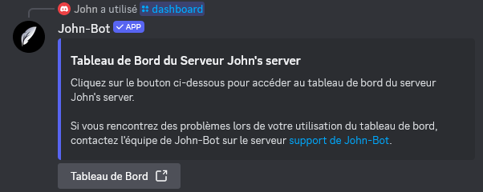

**Tutoriel vidéo lié à cette page :** [Préparer son serveur à la configuration de John-Bot (prérequis) - Tutoriel #2](https://youtu.be/f1vCYjXOlvc)

# :clipboard: Vérifier les permissions
Pour fonctionner correctement, John-Bot doit posséder un certain nombre de permissions. Il est fortement conseillé d'attribuer la permission d'administrateur pour éviter tout conflit.
  Lors de l'ajout de John-Bot, vous avez probablement déjà attribué ces permissions, mais une vérification s'impose. Pour ce faire, rendez-vous dans les paramètres de votre serveur Discord.

# :pushpin: Accéder au tableau de bord
Pour configurer John-Bot, vous devez accéder au tableau de bord (également appelé "dashboard").
  Voici les différentes manières d'y accéder :

## Utiliser la commande /dashboard
Rendez-vous sur le serveur Discord que vous souhaitez configurer et accédez à un salon où vous pouvez exécuter des commandes. Tapez ensuite dans ce salon la commande `/dashboard` et cliquez sur le bouton intitulé `Tableau de bord`.
  Vous serez redirigé vers la page du tableau de bord de votre serveur et devrez peut-être vous authentifier avec votre compte Discord. Si c'est le cas, cliquez simplement sur le bouton `Autoriser` en bas à droite.

## Via le site web
Rendez-vous sur le site web de John-Bot à l'adresse : https://johnbot.app/ et cliquez sur le bouton en haut intitulé `Tableau de bord`. Vous devrez peut-être vous authentifier avec votre compte Discord. Si c'est le cas, cliquez simplement sur le bouton `Autoriser` en bas à droite. Ensuite, choisissez le serveur Discord que vous souhaitez configurer et cliquez dessus. Vous serez alors redirigé vers la page du tableau de bord de votre serveur.

## Avec l'adresse web exacte
Vous pouvez accéder directement au tableau de bord de votre serveur en entrant dans votre navigateur web l'adresse sous le format suivant : `https://johnbot.app/dashboard/guildId`
  Remplacez `guildId` par l'identifiant de votre serveur¹.

# :flag_fr: Définir la langue
Avant de commencer la moindre configuration, il est conseillé de choisir la langue d'affichage de John-Bot.
Découvrez comment faire : [Changer la langue de son serveur](../usage/configuration/langue.md)

---
1 : Trouver l'identifiant de votre serveur : [Où trouver l’ID de mon compte utilisateur / serveur / message ?](https://support.discord.com/hc/fr/articles/206346498-O%C3%B9-trouver-l-ID-de-mon-compte-utilisateur-serveur-message)