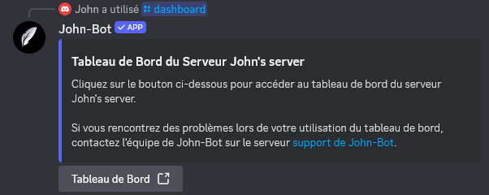

# Configurations basiques

**Tutoriel vidéo lié à cette page :** [Préparer son serveur à la configuration de John-Bot (prérequis) - Tutoriel #2](https://jnbt.xyz/fr/tutorials/start)

## :clipboard: Vérifier les permissions

Pour fonctionner correctement, John-Bot doit posséder un certain nombre de permissions. Il est fortement conseillé d'attribuer la permission d'administrateur pour éviter tout conflit.\
Lors de l'ajout de John-Bot, vous avez probablement déjà attribué ces permissions, mais une vérification s'impose. Pour ce faire, rendez-vous dans les paramètres de votre serveur Discord.

## :pushpin: Accéder au tableau de bord

Pour configurer John-Bot, vous devez accéder au tableau de bord (également appelé "dashboard").\
Voici les différentes manières d'y accéder :

### Utiliser la commande /dashboard

Rendez-vous sur le serveur Discord que vous souhaitez configurer et accédez à un salon où vous pouvez exécuter des commandes. Tapez ensuite dans ce salon la commande `/dashboard` et cliquez sur le bouton intitulé `Tableau de bord`.\
Vous serez redirigé vers la page du tableau de bord de votre serveur et devrez peut-être vous authentifier avec votre compte Discord. Si c'est le cas, cliquez simplement sur le bouton `Autoriser` en bas à droite.

### Via le site web

Rendez-vous sur le site web de John-Bot à l'adresse : https://johnbot.app/ et cliquez sur le bouton en haut intitulé `Tableau de bord`. Vous devrez peut-être vous authentifier avec votre compte Discord. Si c'est le cas, cliquez simplement sur le bouton `Autoriser` en bas à droite. Ensuite, choisissez le serveur Discord que vous souhaitez configurer et cliquez dessus. Vous serez alors redirigé vers la page du tableau de bord de votre serveur.

### Avec l'adresse web exacte

Vous pouvez accéder directement au tableau de bord de votre serveur en entrant dans votre navigateur web l'adresse sous le format suivant : `https://johnbot.app/dashboard/guildId`\
Remplacez `guildId` par l'identifiant de votre serveur¹.

## :flag\_fr: Définir la langue

Avant de commencer la moindre configuration, il est conseillé de choisir la langue d'affichage de John-Bot. Découvrez comment faire : [Changer la langue de son serveur](../usage/configuration/language.md)

## :gem: Activer John-Bot Premium

John-Bot Premium est la version payante de John-Bot qui permet d'obtenir plus de fonctionnalités pour rendre votre serveur Discord encore meilleur. Souscrire à un abonnement Premium permet également de contribuer à payer les frais engendrés par l'utilisation de l'application et donc de permettre une version gratuite complète de John-Bot pour tous, sans condition.


Vous pouvez consulter la liste exhaustive des avantages de la version Premium par rapport à la version gratuite de John-Bot à l'adresse suivante : [https://johnbot.app/premium](https://johnbot.app/premium)


### Souscire à John-Bot Premium

Tout d'abord, rendez-vous sur la page [https://johnbot.app/premium](https://johnbot.app/premium) et choisissez le plan qui correspond à vos besoins. Vous serez redirigé vers la page de paiement Patreon, où vous devrez créer un compte. Suivez les étapes sur Patreon jusqu'à la validation de votre souscription.

### Lier votre compte Patreon

Ensuite, vous devrez lier votre compte Patreon sur le tableau de bord de John-Bot. Pour cela, rendez-vous sur le tableau de bord de l'un de vos serveurs et cliquez sur votre photo de profil en haut à gauche. Assurez-vous que votre compte Patreon est bien lié.

### Activer John-Bot Premium sur un serveur

Finalement, vous devrez activer John-Bot Premium sur les serveurs souhaités en utilisant la commande `/premium` sur les serveurs en question et en confirmant l'activation. Pour désactiver John-Bot Premium, vous pouvez entrer la commande `/premium` et cliquer sur `réinitialiser`.

### Gérer ou annuler votre abonnement

Pour changer de plan, rendez-vous dans la [section `Abonnement` de la page de John-Bot sur Patreon](https://www.patreon.com/c/johnbot/membership). Vous aurez accès aux trois plans proposés et pourrez choisir celui qui correspond à vos besoins.\
Pour annuler votre abonnement, rendez-vous dans la [section `Abonnements` des paramètres de Patreon](https://www.patreon.com/settings/memberships). Vous pourrez annuler votre abonnement en affichant les options supplémentaires et en cliquant sur `Annuler l'abonnement`.

***

1 : Trouver l'identifiant de votre serveur : [Où trouver l’ID de mon compte utilisateur / serveur / message ?](https://support.discord.com/hc/fr/articles/206346498-O%C3%B9-trouver-l-ID-de-mon-compte-utilisateur-serveur-message)
