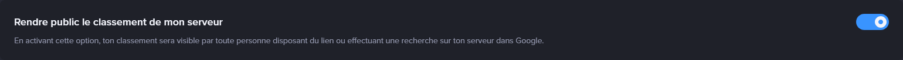
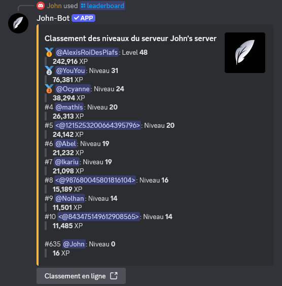
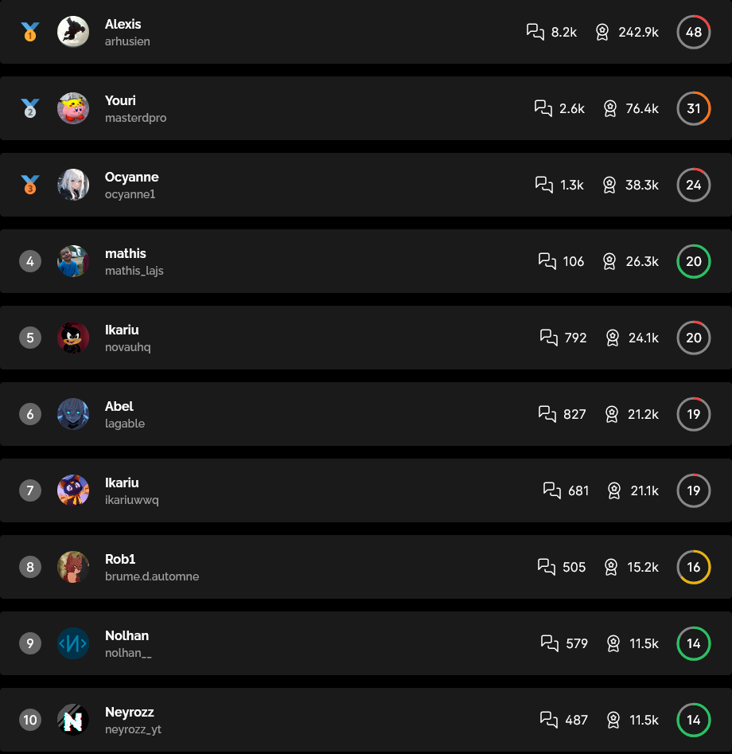
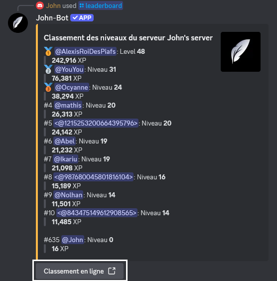
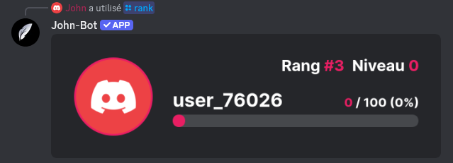
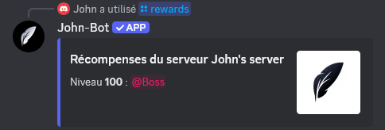

# Niveaux

**Tutoriel vidéo lié à cette page :** [Configurer le système de niveaux de John-Bot - Tutoriel #7](https://jnbt.xyz/fr/tutorials/levels)

## :rocket: Introduction

Pour maintenir une activité constante sur un serveur Discord, la méthode la plus recommandée est de récompenser ses membres avec notamment des niveaux et grades. En se basant sur ce système, John-Bot propose une version évoluée avec des niveaux acquis avec des points d'expérience et l'attribution de récompenses virtuelles via des rôles lorsque des paliers précis sont atteints.

## :tools: Configurer le système

### Accéder au tableau de bord

Tout d'abord, rendez vous sur le tableau de bord de John-Bot par le moyen de votre choix. Découvrez comment faire : [Comment accéder au tableau de bord](../../guide/guide.md#pushpin-accéder-au-tableau-de-bord)

### Accéder aux paramètres

Ensuite, cherchez `Niveaux` sur la colonne de droite, sous le logo et la bannière de votre serveur. Vous arrivez à présent sur une page où vous pouvez accéder à tous les paramètres relatifs au système de niveaux.

### Importer depuis une autre application

Si vous utilisez actuellement une autre application pour gérer le système de niveaux sur votre serveur, vous pouvez importer toutes vos données en quelques instants à l'aide d'une simple commande¹.

À l'heure actuelle, seule l'application MEE6 est supportée mais cette fonctionnalité pourra évoluer en s'étendant à d'autres applications.

Importer depuis MEE6

Avant d'entrer la commande permettant d'importer vos données de niveaux depuis MEE6, vous devez rendre public le classement de votre serveur.

* Pour ce faire, accédez au classement de votre serveur avec la commande `/levels` via l'application MEE6. Connectez-vous ensuite à votre compte Discord sur le site de MEE6 et cliquez sur le bouton `Paramètres`, situé en haut à droite de la page.
* Une fois sur la page des paramètres du classement de votre serveur, activez l'option `Rendre public le classement de mon serveur`, située en haut de la page. Enfin, enregistrez vos modifications.

Ensuite, rendez-vous sur votre serveur et entrez la commande `/xp import` avec John-Bot, puis confirmez le remplacement des données actuelles par celles de MEE6.

Assurez-vous que le système de niveaux de John-Bot est correctement activé et configuré. L'importation ne concerne que les données de niveaux, sans inclure la personnalisation des annonces ou d'autres éléments.

## :earth\_africa: Système global

Le système de niveaux fonctionne avec de l'expérience acquérable lors de l'envoi d'un message ou d'une minute passée dans un salon vocal. Il est possible de définir la quantité de points d'expérience gagnée par message ou minute ainsi qu'un taux. Un niveau correspond à un palier, atteignable en accumulant un nombre précis d'unités d'expérience.

Le détail du fonctionnement pour acquérir de l'expérience, ainsi que l'expérience nécessaire pour débloquer un niveau, est disponible dans [la sous-page liée à cette page](levels-xp.md).

### Annonce de passage de niveau

Lorsqu'un nouveau niveau est débloqué, John-Bot permet d'envoyer instantanément une annonce personnalisée dans un salon défini.

* **Activer l'annonce :** Pour activer l'annonce de passage de niveau, cochez cette option.
* **Activer l'image :** Avec chaque annonce, une image à l'effigie du membre est générée, indiquant également le niveau atteint à cet instant.

<figure><figcaption>
Image d'une annonce de passage de niveau
</figcaption></figure>

* **Choix du salon :** Vous pouvez choisir d'envoyer l'annonce de passage de niveau dans le dernier salon où le membre a envoyé un message² en sélectionnant `Dans le salon actuel` via le menu déroulant, ou d'envoyer l'annonce dans un salon précis, toujours le même pour chaque annonce, en sélectionnant `Dans un salon personnalisé` via le menu déroulant, puis en définissant le salon à l'aide du second menu déroulant apparu plus bas ou sur la droite, selon votre appareil.
* **Message de passage de niveau :** En plus de l'image de passage de niveau, vous pouvez ajouter un message personnalisé, compatible avec [les variables de niveau](../../ressources/variables.md#variable-de-niveaux).

### Options supplémentaires

**Ratio d'expérience**

Cette option permet de définir la quantité de points d'expérience attribuée à un membre par message ou par minute passée en vocal. Vous pouvez choisir une tranche à l'aide du menu déroulant, la quantité exacte sera déterminée aléatoirement.

**Niveau maximum** :gem:

Vous pouvez définir un niveau maximal qui empêchera les membres ayant atteint ce niveau de gagner davantage d'expérience. Pour désactiver l'option, indiquez `0`.

**Expérience en vocal** :gem:

En activant cette option vous autorisez vos membres à gagner des points d'experience en vocal, à condition d'être au moins deux membres humains dans le salon vocal.

**Perte des niveaux lors du départ**

Avec cette option activée, si un membre quitte le serveur, son expérience sera réinitialisée.

**Pas de gain d'experience en ticket**

Avec cette option activée, aucun point d'expérience ne sera attribué aux membres envoyant des messages dans des tickets.³

**Taux d'experience** :gem:

Si vous souhaitez augmenter l'expérience gagnée pour faciliter l'accès aux niveaux supérieurs, vous pouvez choisir d'attribuer des points d'expérience jusqu'à 3 fois plus rapidement.

### Rôles et salons spéciaux

* **Rôles et salons bonus :** Vous pouvez définir des rôles et des salons dans lesquels les messages envoyés ou les minutes passées en vocal rapportent plus de points d'expérience. Vous pouvez ajuster le facteur de bonus⁴ en cliquant sur le nombre situé avant le nom du rôle ou du salon.
* **Rôles et salons sans gain :** Vous pouvez définir des rôles et des salons dans lesquels les messages envoyés ou les minutes passées en vocal ne rapportent aucune expérience.

## :dart: Récompenses

Pour encourager les membres à atteindre les niveaux supérieurs, vous pouvez définir des récompenses déblocables sous forme de rôles lorsqu'un membre atteint un niveau précis.

### Annonce de récompense débloquée

Lorsqu'un nouveau niveau est atteint et qu'une récompense est débloquée, John-Bot permet d'envoyer instantanément une annonce personnalisée dans un salon défini.

* **Activer l'annonce :** Pour activer l'annonce de récompense débloquée, cochez cette option.
* **Activer l'image :** Avec chaque annonce, une image à l'effigie du membre est générée, indiquant également la récompense débloquée.

<figure><figcaption>
Image d'une aannonce de récompense débloquée
</figcaption></figure>

* **Choix du salon :** Vous pouvez choisir d'envoyer l'annonce de récompense débloquée dans le dernier salon où le membre a envoyé un message² en sélectionnant `Dans le salon actuel` via le menu déroulant, ou d'envoyer l'annonce dans un salon précis, toujours le même pour chaque annonce, en sélectionnant `Dans un salon personnalisé` via le menu déroulant, puis en définissant le salon à l'aide du second menu déroulant apparu plus bas ou sur la droite, selon votre appareil.
* **Message de récompense débloquée :** En plus de l'image de récompense débloquée, vous pouvez ajouter un message personnalisé, compatible avec [les variables de niveau](../../ressources/variables.md#variable-de-niveaux).

### Type de rôles récompenses :gem:

Les rôles récompense sont attribués lorsqu'un membre atteint le niveau requis. Vous pouvez choisir qu'un membre ne puisse avoir qu'un seul rôle récompense à la fois sur son profil en séléctionnant `Rôles récompenses évolutifs`. Lorsqu'une nouvelle récompense est débloquée, le rôle actuel sera retiré du profil du membre et remplacé par le nouveau rôle débloqué. Si vous souhaitez que le membre accumule les rôles, sélectionnez `Rôles récompenses cumulables`.

### Configuration des récompenses

Pour créer une récompense, cliquez sur le bouton situé en bas de la page et définissez les deux paramètres suivants :

* **Niveau requis :** Définissez le niveau requis pour débloquer cette récompense en l'indiquant dans le champ prévu à cet effet.
* **Rôles récompense :** Définissez le rôle qui sera attribué en guise de récompense lorsque le membre atteindra le niveau requis en le sélectionnant à l'aide du menu déroulant correspondant.

## :bar\_chart: Classement (leaderboard)

Le classement de votre serveur répertorie les membres par ordre décroissant de leurs points d'expérience, permettant de connaître leur niveau et la quantité de points d'expérience accumulée.\
\
Il est accessible via la commande `leaderboard`, qui affiche les dix premiers du classement, une version complète est disponible en ligne.

Exemple de classement avec la commande /leaderboard

Exemple de classement complet en ligne

### Accéder au classement du serveur

Vous pouvez accéder au classement complet disponible en ligne de deux manières :

* **URL complète :** L'adresse web (URL) du classement d'un serveur est composée ainsi : `https://www.johnbot.app/leaderboard/serverid`. Il suffit de remplacer la variable `serverid` par l'identifiant⁵ de votre serveur.
* **Lien via une commande :** Vous pouvez obtenir ce lien facilement à l'aide de la commande `/leaderboard`.

## :wrench: Liste des commandes

| Commande        | Description                                                                          | Exemple                                                                        |
| --------------- | ------------------------------------------------------------------------------------ | ------------------------------------------------------------------------------ |
| /leaderboard    | Affiche le classement des niveaux des membres du serveur.                            |  |
| /rank ou /level | Affiche votre niveau ou celui d'un membre.                                           |     |
| /xp add         | Ajoute de l'expérience à un membre.                                                  |         |
| /xp remove      | Retire de l'expérience à un membre.                                                  |   |
| /xp import      | Importe les données de niveaux d'autres robots.                                      |                                                                                |
| /xp reset       | Réinitialise les données de niveaux d'un membre ou de tous les membres du serveur.   |     |
| /xp user        | Affiche le nombre total d'expérience d'un membre et son niveau.                      |   |
| /rewards        | Affiche la liste des récompenses pouvant être débloquées avec le système de niveaux. |   |

***

1 : sous réserve de disponibilité de l'application en question 2 : Le message sera envoyé dans la discussion du salon vocal si le membre passe au niveau supérieur dans un salon vocal 3 : les tickets doivent être gérés avec le [système de tickets](tickets.md) de John-Bot 4 : seulement parmis les nombres suivants `1,5 ; 2 ; 2,5 ; 3` 5 : Trouver l'identifiant de votre serveur : [Où trouver l’ID de mon compte utilisateur / serveur / message ?](https://support.discord.com/hc/fr/articles/206346498-O%C3%B9-trouver-l-ID-de-mon-compte-utilisateur-serveur-message)
