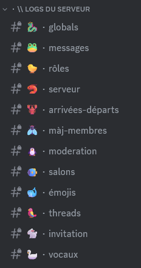
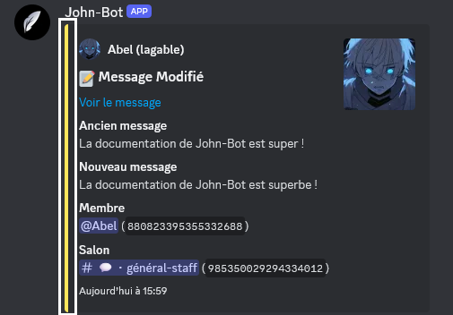

**Tutoriel vidéo lié à cette page :** [Configurer le système de logs de John-Bot - Tutoriel #6](https://jnbt.xyz/fr/tutorials/logs)

## :rocket: Introduction
Un système de logs sur Discord est un outil essentiel pour surveiller et enregistrer les activités qui se produisent sur un serveur Discord. Il permet d'enregistrer dans des salons du serveur toutes les activités relatives aux messages, aux rôles, au serveur, aux arrivées et départs, aux mises à jour des membres, à la modération, aux salons, aux emojis, aux threads (fils) et aux activités dans les salons vocaux.
  John-Bot permet de choisir un salon où tous les logs confondus seront envoyés mais permet également de spécialiser certains salons pour certains systèmes.

Vous pourrez également personnaliser de nombreux éléments pour que votre système soit le plus utile et pratique possible, tels que la couleur, les événements du salon de réception globale et même des salons ignorés par le système.

## :tools: Configurer le système

### Accéder au tableau de bord

Tout d'abord, rendez vous sur le tableau de bord de John-Bot par le moyen de votre choix. Découvrez comment faire : [Comment accéder au tableau de bord](../../guide/base.md#pushpin-accéder-au-tableau-de-bord)

### Accéder aux paramètres

Ensuite, cherchez `Logs` sur la colonne de droite, sous le logo et la bannière de votre serveur. Vous arrivez à présent sur une page où vous pouvez accéder à tous les paramètres relatifs au système de logs.

### Activer le système

Pour dévoiler les paramètres du système, vous devez activer ce dernier à l'aide du bouton associé.

### Salon de réception global

Le salon de réception global des logs permet d'accueillir un grand nombre d'événements au même endroit. Vous devez d'abord définir le salon de réception global dans le champ correspondant. Vous pouvez ensuite choisir les événements qui seront envoyés dans ce salon en cochant les cases associées dans la liste sous la `configuration globale de la couleur des embeds du système`. Si vous souhaitez activer tous les événements, cachez simplement la case `Activer ou désactiver tous les événements`.

### Salon⸱s ignoré⸱s

Toutes les actions effectuées dans les salons ignorés ne seront pas répertoriées dans les logs, tous les événements confondus. Pour définir un ou plusieurs salons ignorés, sélectionnez-en parmi la liste dans le champ correspondant.

### Couleur globale :gem:

Cette option vous permet de définir la couleur des embeds de logs qui seront envoyés sur le serveur. Pour ce faire, sélectionnez la couleur souhaitée parmi les 6 propositions ou à l'aide du sélecteur de couleurs.

### Salons spécialisés

Pour chaque événement du système, vous pouvez définir un salon spécifique. Pour cela, choisissez l'événement que vous souhaitez et définissez un salon à l'aide du menu déroulant correspondant.


Si le salon de réception global est configuré sur le même salon qu'un ou plusieurs événements spécifiques, les messages de logs seront envoyés en double.
