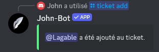
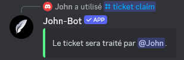
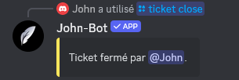
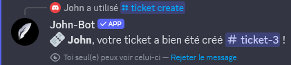
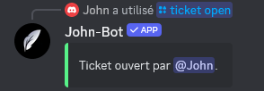
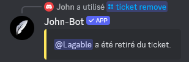
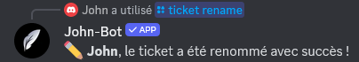
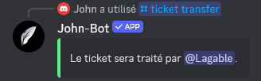
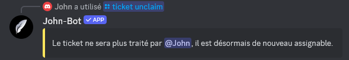

# Tickets

**Tutoriel vidéo lié à cette page :** [Configurer le système de tickets de John-Bot - Tutoriel #4](https://youtu.be/wnepmF3Bdbc)

## :rocket: Introduction

Un système de ticket permet aux membres de contacter l'équipe du serveur (staff) dans un salon privé créé sur demande. John-Bot permet de pousser ce type de système à son paroxysme en ajoutant notamment la possibilité de choisir le motif le plus approprié à une demande d'assistance et de le préciser à l'aide d'un modèle sur Discord.

Pour créer un système de ticket, il faut créer un ou plusieurs panneaux, qui correspondent chacun à un type de demande d'assistance (par exemple, un pour contacter la modération, un pour demander un partenariat et un autre pour les demandes administratives). Ensuite, vous devrez créer un ou plusieurs embeds qui correspondent aux messages permettant aux membres d'interagir pour créer un ticket. Vous pouvez ajouter plusieurs panneaux à chacun. Enfin, vous avez la possibilité de créer un ou plusieurs modèles qui correspondent aux formulaires apparaissant lorsqu'un membre interagit avec l'un des boutons et accède donc à un panneau.

## :earth\_africa: Configuration globale

### Accéder au tableau de bord

Tout d'abord, rendez vous sur le tableau de bord de John-Bot par le moyen de votre choix. Découvrez comment faire : [Comment accéder au tableau de bord](../../guide/base.md#pushpin-accéder-au-tableau-de-bord)

### Accéder aux paramètres

Ensuite, cherchez `Tickets` sur la colonne de droite, sous le logo et la bannière de votre serveur. Vous arrivez à présent sur une page où vous pouvez configurer tous les paramètres de votre serveur relatifs au système de ticket et consulter les transcriptions.

### Logs

Les logs permettent d'enregistrer toutes les actions relatives aux tickets dans un salon du serveur.\
À la suppression d'un ticket, un certain nombre d'informations relatives au ticket en question seront rendues disponibles sur un message. Vous retrouverez l'identifiant du ticket, l'utilisateur à l'origine du ticket, l'utilisateur qui a fermé le ticket, l'utilisateur qui a supprimé le ticket, la date d'ouverture du ticket, le nom du ticket, le membre de l'équipe d'assistance qui a pris en charge le ticket et la liste des utilisateurs ayant écrit un message dans le ticket (John-Bot exclu). C'est également sous ce message que vous pouvez retrouver le lien vers la transcription du ticket, sous réserve d'activation de l'option comme indiqué plus loin sur cette page. Cette dernière est jointe au message mais difficilement lisible et accessible.

Pour activer les logs à la suppression d'un ticket, cochez simplement la case `Activer les logs` et sélectionnez le salon dans lequel vous souhaitez stocker ces messages.


Il est fortement conseillé de rendre le salon des logs de ticket privé. En effet, certaines informations pourraient s'avérer privées et ne doivent donc pas être accessibles au premier venu mais à l'équipe de confiance.


### Limite de tickets globale

Cette option permet de limiter le nombre de tickets total ouverts simultanément par un membre sur le serveur, tous panneaux confondus. Si une limite de ticket est appliquée plus tard à l'un des panneaux, cette dernière prendra le dessus pour le panneau en question. Choisissez simplement le nombre de tickets maximum avec le champ correspondant.

### Transcriptions

Une transcription permet de remonter l'historique de la conversation du ticket. Elles peuvent s'avérer très pratiques pour référence future, suivi des problèmes ou même formation de l'équipe. Les transcriptions de John-Bot permettent de visualiser l'historique de la conversation dans une mise en page simulant l'originale de Discord pour rendre la lecture plus agréable et cohérente.

#### Activer les transcriptions

Pour activer les transcriptions, vous devez d'abord avoir activé les logs des tickets et défini un salon d'envoi des logs. Une fois cela fait, cliquez simplement sur le bouton `Activer les transcriptions`.

#### Consulter les transcriptions

Vous pouvez consulter les transcriptions de deux façons différentes :

* Premièrement, vous pouvez vous rendre sur le tableau de bord puis sur la page `Tickets` et cliquer sur le bouton en haut à droite `Voir les transcriptions`. Vous retrouverez ensuite la liste de toutes les transcriptions stockées pour votre serveur ainsi qu'un moteur de recherche pour vous aider à trouver celle que vous cherchez.
* Deuxièmement, vous pouvez vous rendre dans le salon de logs des tickets directement sur votre serveur Discord et chercher le message correspondant à la transcription souhaitée. Vous pouvez ensuite cliquer sur le bouton lié au message `Voir la transcription` et serez redirigé vers le lecteur de John-Bot.


Si vous ne trouvez pas la transcription que vous cherchez, c'est qu'elle n'est plus stockée car le message de logs du ticket en question a été supprimé ou que votre ticket remonte avant le 26 janvier 2024. Dans la première situation, rien à faire, votre transcription est définitivement effacée. Dans la seconde situation, il suffit de chercher le message de logs associé au ticket souhaité, de télécharger le fichier .html joint au message et de l'ouvrir dans votre visionneuse de fichiers .html. Les navigateurs web (Mozilla Firefox, Microsoft Edge, Opera, Google Chrome...) supportent généralement ce type de fichiers.


### Rôle·s d'exclusion

Les rôles d'exclusion permettent d'empêcher certains membres d'ouvrir des tickets. Lorsqu'un membre possède un rôle d'exclusion, il sera impossible pour lui de créer un ticket. Choisissez un ou plusieurs rôles parmi votre liste de rôles dans le champ correspondant pour configurer cette option.

## :jigsaw: Configuration panneau·x

### Créer un panneau

Avant de commencer à configurer votre ou vos panneaux, vous devez les créer. Pour cela, cliquez simplement sur le bouton `Créer un panneau` situé sous les paramètres globaux.

### Dupliquer un panneau

Vous pouvez également créer un panneau à partir d'un déjà existant pour retrouver exactement les mêmes paramètres et le personnaliser. Cela permet d'éviter de devoir reconfigurer tous les paramètres pour une différence mineure entre les deux panneaux. Pour cela, cliquez simplement sur le bouton `Dupliquer` correspondant au panneau souhaité et validez votre choix via la fenêtre qui apparait.

### Modifier un panneau

Pour modifier les paramètres d'un panneau existant, cliquez simplement sur le bouton `Modifier` correspondant au panneau souhaité.

### Supprimer un panneau

Pour supprimer un panneau existant, cliquez simplement sur le bouton `Supprimer` correspondant au panneau souhaité et validez votre choix via la fenêtre qui apparaît.

### Configurer un panneau

Une fois dans les paramètres d'un panneau, vous pouvez configurer de nombreuses options pour personnaliser selon vos besoins le système.\
Une fois les configurations terminées, il vous suffit de cliquer sur le bouton vert `Enregistrer` situé en bas à droite de la fenêtre de configuration. Si vous ne souhaitez pas conserver vos modifications, cliquez simplement sur `Annuler`.

#### Nom du panneau

Le nom du panneau permet de le nommer pour vous permettre de vous repérer parmi tous vos panneaux, mais il ne sera en aucun cas affiché aux membres. Il est facultatif. Si vous ne donnez pas de nom vous-même, il sera automatiquement nommé par un numéro tel que `Panneau #1`.

#### Nom du ticket

Le nom du ticket correspond au nom qui sera donné par défaut au salon créé spécifiquement pour le ticket. Vous pouvez lui donner un nom pour vous permettre de le différencier en utilisant les variables. Si vous ne remplissez pas le champ, le nom sera automatiquement `aide-{user.name}`.

#### Catégorie de création des tickets

Dans ce champ, définissez la catégorie du serveur dans laquelle les salons attribués aux différents tickets du panneau seront créés. En cas de débordement de la catégorie, c'est-à-dire lorsque la catégorie aura atteint son maximum de tickets, ils seront créés hors catégorie. Pour la définir, choisissez la catégorie souhaitée avec le menu de sélection du champ ou recherchez en tapant directement dans le champ.

#### Catégorie de fermeture des tickets :gem:

La catégorie de fermeture des tickets permet de se débarrasser des tickets fermés pour les traiter plus tard. Les salons correspondants à des tickets fermés seront instantanément déplacés dans la catégorie définie. Pour la définir, choisissez la catégorie souhaitée avec le menu de sélection du champ ou recherchez en tapant directement dans le champ.

#### Modèle lié au panneau

Dans ce champ, vous pouvez définir le modèle qui apparaitera avant l'ouverture du ticket, lorsque le membre cliquera sur le bouton. Pour cela, choisissez le modèle souhaité avec le menu de sélection du champ ou recherchez en tapant directement dans le champ.


Pour apprendre à configurer un modèle, consulter la catégorie de la documentation correspondante, sur cette page : [Configuration modèle·s](tickets.md#configuration-modele-s).


#### Période avant l'envoi du rappel d'inactivité :gem:

Vous pouvez choisir pendant combien de temps le ticket doit n'avoir reçu de message avant l'envoir du rappel d'inactivité. Par défaut, cette durée est d'une semaine, soit 7 jours. Cette durée n'a une précision que d'environ 6 heures.\
Pour définir la période avant l'envoi du rappel d'inactivité, séléctionnez l'option qui vous convient le mieux dans le menu de séléction disponible dans le champ.


Cette option n'est affective que lorsque l'option \`**Activer le rappel d'inactivité**\` est activée. Pour apprendre à l'activer, consultez cette catégorie, sur cette page : [Activer le rappel d'inactivité](tickets.md#rappel-dinactivite).


#### Limite de tickets du panneau

La limite de tickets du panneau permet de limiter le nombre de tickets ouverts par un membre sur ce même panneau. Par exemple, si la limite de tickets du panneau est de 2, une fois que le membre aura ouvert 2 tickets, il ne pourra plus ouvrir un troisième ticket avant d'avoir fermé l'un des deux autres. Pour la définir, choisissez `Activer` et entrez un nombre dans le champ `Limite de tickets`.\
Si cette limite est définie, elle prend le dessus sur la limite globale définie préalablement.

#### Rôles des équipes

Les rôles des équipes permettent de définir plusieurs permissions en fonction des rôles. Ci-dessous, retrouvez l'explication détaillée pour chaque permission qui peut être attribuée. Pour définir un ou des rôles pour une permission, cliquez sur le champ et sélectionnez le ou les rôles souhaités. Vous pouvez également entrer le nom du rôle pour le rechercher.

* **Rôles de l'équipe d'assistance :** Les membres de l'équipe d'assistance sont désignés pour accéder au ticket et répondre dans celui-ci. Par défaut, ils peuvent également le traiter, le fermer, le rouvrir ou utiliser les commandes de gestion.
* **Rôles de l'équipe responsable :** Les membres de l'équipe responsable ont les mêmes permissions que l'équipe d'assistance, mais avec certains privilèges tels que la gestion exclusive du ticket.
* **Rôles à mentionner lors de l'ouverture :** Les rôles à mentionner lors de l'ouverture seront, comme leur nom l'indique, mentionnés à l'ouverture du ticket, sans message apparent, en utilisant la méthode dite du "ghost-ping". Le membre à l'origine du ticket sera toujours mentionné, mais choisir un rôle qu'il possède ne le mentionnera pas deux fois.
* **Rôles d'exclusion :** Les rôles d'exclusion empêchent certains membres d'ouvrir des tickets dans le panneau. Lorsqu'un membre possède un rôle d'exclusion, il lui est impossible de créer un ticket dans le panneau.

#### Assignation des tickets

L'assignation des tickets permet à l'équipe d'assistance de mieux s'organiser. Au simple clic sur le bouton `Traiter` joint au message d'ouverture, le membre de l'équipe d'assistance en question sera désigné comme "Traitant" du ticket et un message sera envoyé dans le salon pour le signaler. Pour activer cette option, cochez simplement la case associée.


Cette option permet d'utiliser l'option de \`**Gestion exclusive du ticket**\`. Pour apprendre à l'activer, consultez cette catégorie, sur cette page : [Gestion exclusive du ticket](tickets.md#gestion-exclusive-du-ticket).


#### Rappel d'inactivité

Le rappel d'inactivité permet de rappel à l'ensemble des participants du ticket que celui-ci est innactif à l'aide d'un message envoyé un bout d'une durée définie. Pour activer cette option, cochez simplement la case associée.


Pour savoir comment définir le temps qui doit s'écouler avant l'envoi du rappel, consultez cette catégorie sur cette page : [Période avant l'envoi du rappel d'inactivité](tickets.md#periode-avant-lenvoi-du-rappel-dinactivite).


#### Avertissement en message privé

L'avertissement en message privé est un message envoyé en privé au membre à l'origine du ticket lors de la suppression de ce dernier. Il permet au membre en question de confirmer que son ticket a bien été supprimé et lui permet également d'obtenir quelques informations. Pour l'activer, cochez simplement la case associée.

#### Gestion exclusive du ticket

La gestion exclusive permet de n'autoriser que le membre de l'équipe d'assistance traitant le ticket à parler dans celui-ci, à l'exception des administrateurs et des membres de l'équipe responsable. Pour activer cette option, cochez simplement la case associée.

#### Fermeture du ticket au départ du membre :gem:

La fermeture du ticket au départ du membre permet de fermer automatiquement un ticket lorsque le membre qui en est à l'origine quitte le serveur. Pour activer cette option, cochez simplement la case associée.

#### Visuel du bouton

Pour rendre votre bouton plus attrayant ou compréhensible, vous pouvez le personnaliser à l'aide des nombreuses options proposées.

* **Label du bouton :** Le label permet de personnaliser le texte affiché sur le bouton. Par défaut, il sera identique au nom du panneau.
* **Description du bouton** :gem: **:** La description permet de donner plus d'indication à votre bouton. Elle n'est visible que lorsque l'option de menu de sélection est activée. Découvrez comment l'activer sur cette page, dans la section correspondante : [Style d'affichage des panneaux](tickets.md#personnalisation)
* **Émoji du bouton :** L'emoji ou émoticône permet d'illustrer votre bouton. Vous pouvez choisir parmi tous les emojis Discord à l'aide du sélecteur.
* **Couleur du bouton :** Pour préciser votre bouton, vous pouvez choisir entre les quatre couleurs proposées par Discord : le bleu, le vert, le rouge ou le gris.

#### Permissions des rôles

* **Créer un ticket :** Pour définir qui peut créer un ticket sur ce panneau, choisissez un ou plusieurs rôles dans le champ correspondant. Si le champ est laissé vide, tous les membres pourront créer un ticket, à condition de ne pas posséder un rôle d'exclusion de ticket.
* **Réclamer le ticket :** Pour définir qui peut réclamer ou traiter un ticket sur ce panneau, choisissez un ou plusieurs rôles dans le champ correspondant. Si le champ est laissé vide, tous les membres de l'équipe d'assistance pourront créer un ticket.
* **Fermer le ticket :** Pour définir qui peut fermer un ticket ouvert sur ce panneau, choisissez un ou plusieurs rôles dans le champ correspondant. Si le champ est laissé vide, tous les membres ayant accès au ticket pourront le fermer.
* **Rouvrir le ticket :** Pour définir qui peut ouvrir un ticket après sa fermeture sur ce panneau, choisissez un ou plusieurs rôles dans le champ correspondant. Si le champ est laissé vide, tous les membres de l'équipe d'assistance pourront rouvrir un ticket.
* **Supprimer le ticket :** Pour définir qui peut supprimer un ticket fermé sur ce panneau, choisissez un ou plusieurs rôles dans le champ correspondant. Si le champ est laissé vide, tous les membres ayant accès au ticket fermé pourront le supprimer.

#### Thread de discussion privé

Le thread (ou fil) de discussion privé permet à l'équipe d'assistance de discuter autour du sujet spécifique du ticket à l'abri des regards et sans devoir créer un nouveau salon sur le serveur. Pour l'activer, cochez simplement la case associée. Une fois l'option activée, vous pourrez personnaliser quelques critères esthétiques.

**Nom du thread**

Dans ce champ, entrez le nom qui sera automatiquement donné lors de la création du thread (ou fil). Vous pouvez utiliser [les variables](../../ressources/variables.md).

**Titre de l'embed de création du thread**

Lors de la création du thread privé, un message d'ouverture sera automatiquement envoyé. Dans ce champ, personnalisez le titre qui sera donné à l'embed de ce message.

**Description de l'embed de création du thread**

Lors de la création du thread privé, un message d'ouverture sera automatiquement envoyé. Dans ce champ, personnalisez la description qui sera donnée à l'embed de ce message.

#### Message d'ouverture

Le message d'ouverture sera le premier message envoyé dès l'ouverture du ticket et sera également épinglé. Il permet d'obtenir quelques informations essentielles pour le ticket ainsi qu'un message permettant de donner quelques indications au membre. Il contient également les réponses au modèle si le panneau en dispose. Vous pouvez personnaliser certains éléments de ce message, notamment pour vous permettre d'orienter le membre à l'origine du ticket.

**Message texte**

Le message texte est le texte qui sera affiché hors de l'embed, comme un utilisateur Discord classique. Vous pouvez utiliser les emojis et le markdown¹ pour personnaliser votre texte. Pour désactiver le message texte, laissez le champ vide.

**Embed**

L'embed est la partie du message qui peut comporter plusieurs éléments personnalisables et qui sera affichée sous le message texte. Il est impossible à envoyer pour un utilisateur Discord classique. Vous pouvez utiliser les champs disponibles pour personnaliser votre embed.

* **Activer l'embed d'ouverture :** Vous pouvez cocher cette case si vous souhaitez activer l'embed dans votre message d'ouverture. Si vous souhaitez désactiver l'embed, décochez cette case.
* **Icône de l'auteur de l'embed** :gem: **:** Vous pouvez illustrer votre embed en ajoutant une image (qui peut être animée) à votre auteur, uniquement visible lorsque l'auteur a un nom.
* **Nom de l'auteur de l'embed** :gem: **:** Vous pouvez personnaliser votre embed en ajoutant un auteur, que vous pouvez nommer comme bon vous semble.
* **Lien de l'auteur de l'embed** :gem: **:** Vous pouvez personnaliser votre embed en ajoutant un lien vers un site externe à l'auteur.
* **Titre de l'embed :** Vous pouvez personnaliser votre embed en y ajoutant un titre.
* **Description de l'embed :** Vous pouvez personnaliser votre embed en y ajoutant une description.
* **Couleur de l'embed :** Vous pouvez choisir une couleur pour personnaliser votre embed à l'aide du sélécteur.
* **Lien de la vignette de l'embed** :gem: **:** Vous pouvez illustrer votre embed en y ajoutant une vignette.
* **Lien de l'image de l'embed :** Vous pouvez illustrer votre embed en y ajoutant une image.
* **Icône du footer de l'embed** :gem: **:** Vous pouvez compléter votre embed à l'aide d'une image de footer.
* **Texte du footer de l'embed** :gem: **:** Vous pouvez compléter votre embed à l'aide du footer.

## :camera: Configuration embed·s

### Créer un embed

Avant de commencer à configurer votre ou vos embeds, vous devez d'abord les créer. Pour ce faire, cliquez simplement sur le bouton `Créer un embed` situé sous les paramètres des panneaux.

### Dupliquer un embed

Vous pouvez également créer un embed à partir d'un embed existant pour conserver les mêmes paramètres et le personnaliser. Cela vous évite de devoir reconfigurer tous les paramètres pour une différence mineure entre les deux embeds. Pour ce faire, cliquez simplement sur le bouton `Dupliquer` correspondant à l'embed souhaité et validez votre choix via la fenêtre qui apparaît.

### Modifier un embed

Pour modifier les paramètres d'un embed existant, cliquez simplement sur le bouton `Modifier` correspondant à l'embed souhaité.

### Supprimer un embed

Pour supprimer un embed existant, cliquez simplement sur le bouton `Supprimer` correspondant à l'embed souhaité et confirmez votre choix via la fenêtre qui apparaît.

### Configurer un embed

Une fois dans les paramètres d'un embed, vous pouvez configurer de nombreuses options pour personnaliser le système selon vos besoins. Une fois les configurations terminées, il vous suffit de cliquer sur le bouton vert `Enregistrer` situé en bas à droite de la fenêtre de configuration. Si vous ne souhaitez pas conserver vos modifications, cliquez simplement sur `Annuler`.

#### Salon d'envoi de l'embed

Dans ce champ, définissez dans quel salon votre embed sera envoyé en utilisant le menu de sélection associé.

#### Panneaux liés à l'embed

Choisissez quels seront les panneaux avec lesquels les membres pourront ouvrir un ticket. Organisez vos panneaux dans l'ordre que vous souhaitez, ils apparaîtront de la même manière sur l'embed. Pour cela, sélectionnez votre ou vos panneau(x) à l'aide du sélecteur associé.

#### Personnalisation

* **Icône de l'auteur de l'embed** :gem: **:** Vous pouvez illustrer votre embed en ajoutant une image (qui peut être animée) à votre auteur, uniquement visible lorsque l'auteur a un nom.
* **Nom de l'auteur de l'embed** :gem: **:** Vous pouvez personnaliser votre embed en ajoutant un auteur, que vous pouvez nommer comme bon vous semble.
* **Lien de l'auteur de l'embed** :gem: **:** Vous pouvez personnaliser votre embed en ajoutant un lien vers un site externe à l'auteur.
* **Titre de l'embed :** Vous pouvez personnaliser votre embed en y ajoutant un titre.
* **Style d'affichage des panneaux :** Vous pouvez choisir le style d'affichage des panneaux en sélectionnant l'option souhaitée.
* **Description de l'embed :** Vous pouvez personnaliser votre embed en y ajoutant une description.
* **Couleur de l'embed :** Vous pouvez choisir une couleur pour personnaliser votre embed à l'aide du sélecteur.
* **Lien de la vignette de l'embed** :gem: **:** Vous pouvez illustrer votre embed en y ajoutant une vignette.
* **Lien de l'image de l'embed :** Vous pouvez illustrer votre embed en y ajoutant une image.
* **Icône du footer de l'embed** :gem: **:** Vous pouvez compléter votre embed à l'aide d'une image de footer. Par défaut, l'image sera la photo de profil du bot.
* **Texte du footer de l'embed** :gem: **:** Vous pouvez compléter votre embed à l'aide du footer. Par défaut, il sera `Propulsé par johnbot.app`.

### Envoyer un embed

Une fois votre configuration terminée, vous pouvez publier votre embed en l'envoyant dans le salon défini préalablement. Pour ce faire, cliquez sur le bouton `Envoyer l'embed` associé à l'embed choisi.

## :bookmark\_tabs: Configuration modèle·s

Un modèle est un formulaire qui sera proposé au membre via une pop-up native à Discord pour lui permettre de répondre à jusqu'à 5 questions, pour préciser le sujet du ticket. Les résultats des réponses seront joints à un embed au message d'ouverture du ticket.

### Créer un modèle

Avant de commencer à configurer votre ou vos modèle·s, vous devez les créer. Pour cela, cliquez simplement sur le bouton `Créer un modèle` situé sous les paramètres des embeds.

### Dupliquer un modèle

Vous pouvez également créer un modèle à partir d'un déjà existant pour retrouver exactement les mêmes paramètres et le personnaliser. Cela permet d'éviter de devoir reconfigurer tous les paramètres pour une différence mineure entre les deux modèles. Pour cela, cliquez simplement sur le bouton `Dupliquer` correspondant au modèle souhaité et validez votre choix via la fenêtre qui apparaît.

### Modifier un modèle

Pour modifier les paramètres d'un modèle existant, cliquez simplement sur le bouton `Modifier` correspondant au modèle souhaité.

### Supprimer un modèle

Pour supprimer un modèle existant, cliquez simplement sur le bouton `Supprimer` correspondant au modèle souhaité et validez votre choix via la fenêtre qui apparaît.

### Configurer un modèle

Une fois dans les paramètres d'un modèle, vous pouvez ajouter jusqu'à 5 questions selon vos besoins et définir quelques paramètres.\
Une fois les configurations terminées, il vous suffit de cliquer sur le bouton vert `Enregistrer` situé en bas à droite de la fenêtre de configuration. Si vous ne souhaitez pas conserver vos modifications, cliquez simplement sur `Annuler`.

#### Titre du modèle

Dans ce champ, vous pouvez définir un titre au modèle. Celui-ci permet de vous aider à vous organiser mais est également affiché en haut de la pop-up.

#### Configuration des questions

Pour chaque question, vous pouvez personnaliser certains éléments esthétiques et réorganiser vos questions entre elles. Pour créer une nouvelle question, cliquez sur le bouton `+`, situé en dessous de la liste des questions. Pour supprimer une question existante, cliquez sur le bouton rouge `Supprimer` situé en bas à droite de la question correspondante.

* **Label de la zone de texte :** Le label de la zone de texte correspond à la question posée (n°1 sur l'image).
* **Style de la zone de texte :** En définissant le style de la zone de texte (n°2 sur l'image), choisissez si le membre pourra répondre dans un champ large ou plus court. Cela ne change rien à la limite de caractères qui sera de 1024 pour les deux.
* **Placeholder de la zone de texte :** Le placeholder est le texte affiché en transparence dans le champ de réponse, pas dessus lequel le membre va écrire (n°3) sur l'image.
* **Question obligatoire :** Vous pouvez définir si la question doit obligatoirement être remplie par le membre ou s'il pourra soumettre le formulaire sans y répondre (n°4 sur l'image). Si la question n'a pas de réponse, la formule `Aucun Objet` sera à la place de la réponse.


Une fois votre modèle configuré, n'oubliez pas de le lier au panneau de votre choix : [Modèle lié au panneau, configurer un panneau](tickets.md#modèle-lié-au-panneau)


## :wrench: Liste des commandes
| Commande | Description | Exemple |
| -------- | ----------- | ------- |
| /ticket add | Ajoute un membre au ticket. |  |
| /ticket claim | Assigne un membre de l'équipe d'assistance au traitement du ticket. |  |
| /ticket close | Ferme le ticket. |  |
| /ticket close-request | Demande la fermeture du ticket. |  |
| /ticket create | Crée un ticket. |  |
| /ticket delete | Supprime un ticket fermé. |  |
| /ticket open | Ouvre un ticket fermé. |  |
| /ticket remove | Retire un membre du ticket. |  |
| /ticket rename | Renomme le ticket. |  |
| /ticket transfer | Transfert l'assignation du ticket à un autre membre de l'équipe d'assistance. |  |
| /ticket unclaim | Retire l'assignation du ticket au traitant. |  |

---
1 : Découvrir ce qu'est le Markdown : [Markdown de Texte 101 (Formatage du chat : gras, italique, souligné)](https://support.discord.com/hc/fr/articles/210298617-Markdown-de-Texte-101-Formatage-du-chat-gras-italique-soulign%C3%A9)