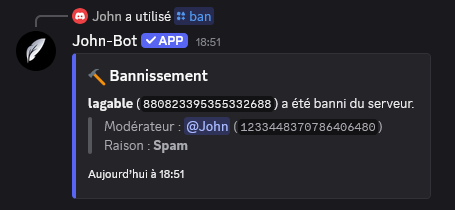
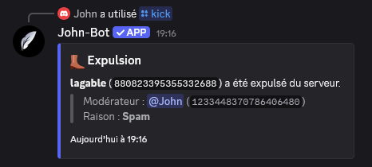
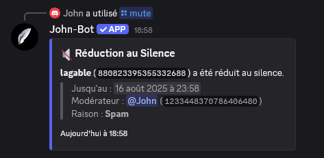
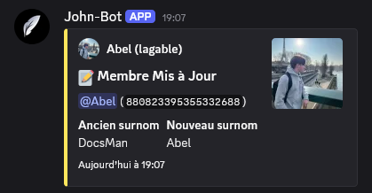
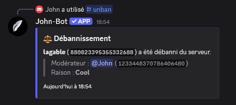
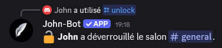
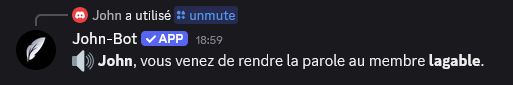
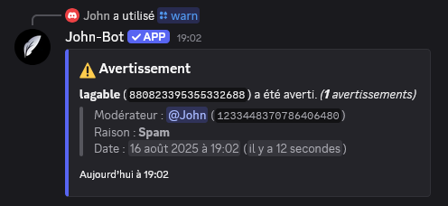

**Tutoriel vidéo lié à cette page :** [Modérer efficacement son serveur avec John-Bot - Tutoriel #5](https://jnbt.xyz/fr/tutorials/moderation)

### :rocket: Introduction

Le système de modération par commandes de John-Bot vous donne les outils pour modérer efficacement votre serveur Discord. Grâce à des commandes puissantes, vous pouvez simplifier et accélérer la modération pour maintenir un environnement sécurisé, le tout avec des fonctionnalités avancées via John-Bot inaccessibles aux utilisateurs classiques.

### :clipboard: Liste des commandes
| Commande | Description | Exemple |
| -------- | ----------- | ------- |
| /ban | Banni un utilisateur du serveur. |  |
| /clear | Supprime un nombre de messages dans un salon. |  |
| /kick | Expulse un membre du serveur. |  |
| /lock | Verrouille un salon du serveur. |  |
| /mute | Réduit un membre au silence pendant un certain temps. |  |
| /nickname | Change le surnom d'un membre du serveur. |  |
| /slowmode disable | Désactive le mode lent d'un salon. |  |
| /slowmode set | Défini le mode lent d'un salon. |  |
| /unban | Révoque le bannissement d'un utilisateur. |  |
| /unlock | Déverrouille un salon du serveur. |  |
| /unmute | Rend la parole à un membre réduit au silence. |  |
| /warn | Averti un membre du serveur. |  |
| /warnings clear | Supprime les avertissements d'un membre ou de tous les membres du serveur. |  |
| /warnings list | Affiche la liste des avertissements d'un membre. |  |
| /warnings remove | Supprime l'avertissement d'un membre. |  |