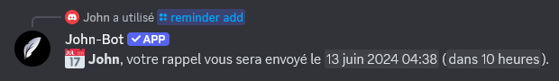
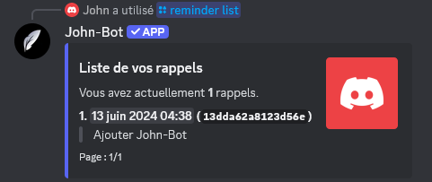

**Tutoriel vidéo lié à cette page :** [Utiliser les rappels de John-Bot sur Discord - Tutoriel #11](https://jnbt.xyz/fr/tutorials/reminders)

# :rocket: Introduction

Si vous avez une tâche que vous ne devez surtout pas oublier, vous pouvez utiliser le système de rappels de John-Bot. Il permet, en une simple commande exécutable sur n'importe quel serveur ou en messages privés, de programmer une alerte, qui sera envoyée sous forme de message privé à une heure précise.

# :alarm_clock: Gérer les rappels

## Créer un rappel

Pour programmer un message de rappel, entrez la commande `/reminder add`. Choisissez ensuite dans les champs proposés le motif (qui vous sera renvoyé au moment du rappel) et le temps qui devra s'écouler avant l'envoi. Un message de confirmation vous est ensuite envoyé.


Notez que la durée qui devra s'écouler avant l'envoi ne peut être ni inférieure à une minute ni supérieure à 365 jours.


## Supprimer un rappel

Si vous n'avez plus besoins d'un rappel précédement programmée, vous pouvez le supprimer facilement. Entrez la commande `/reminder remove` et séléctionnez le rappel à supprimer. Un message de confirmation vous sera ensuite envoyé.

## Lister les rappels en cours

Pour visualiser tous vos rappels et les anticiper, entrez la commande `/reminder list`.

# :clipboard: Liste des commandes

 Commande | Description | Exemple |
| -------- | ----------- | ------- |
| /reminder add | Définit un rappel. |  |
| /reminder list | Affiche la liste de tous vos rappels. |  |
| /reminder remove | Supprime un rappel. |  |