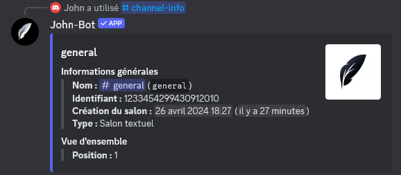
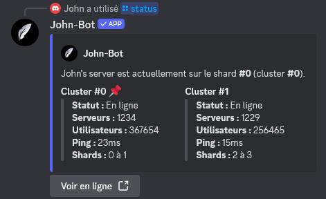

# :rocket: Introduction
Si vous souhaitez obtenir des informations sur un serveur, un utilisateur... ou encore la photo ou bannière de n'importe quel utilisateur ou serveur et bien plus, les commandes d'information de John-Bot sont là pour vous ! Découvrez l'intégralité de ces commandes décrites précisement sur cette page.

# :clipboard: Liste des commandes
| Commande | Description | Exemple |
| -------- | ----------- | ------- |
| /bot-info | Affiche quelques informations sur John-Bot. |  |
| /user avatar | Affiche l'avatar d'un utilisateur. |  |
| /user banner | Affiche la bannière d'un utilisateur. |  |
| /user info | Affiche quelques informations sur un utilisateur. |  |
| /server icon | Affiche l'icône du serveur. |  |
| /server banner | Affiche la bannière du serveur. |  |
| /server info | Affiche quelques informations sur le serveur. |  |
| /server members | Affiche quelques informations sur les membres du serveur. |  |
| /role info | Affiche quelques informations sur un rôle. |  |
| /role color | Affiche la couleur d'un rôle. |  |
| /channel-info | Affiche quelques informations sur un salon. |  |
| /ping | Affiche le temps de latence de John-Bot. |  |
| /status | Affiche le status des shards de John-Bot. |  |
| /uptime | Affiche depuis combien de temps John-Bot est opérationnel. |  |
| /color | Affiche quelques informations sur une couleur. |  |